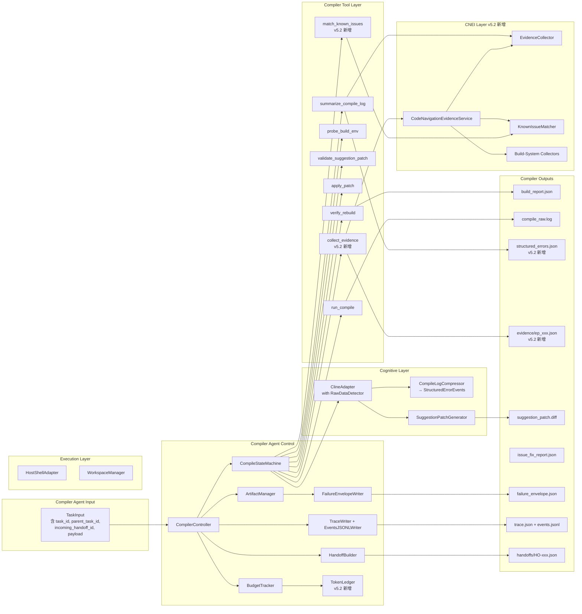

# Compiler Agent 设计文档 v5.2-RC2.2（Phase 1A 实施候选版，Sprint 0 Spike Gate 启动版）

**版本**：v5.2-RC2.2
**状态**：**Implementation Candidate / Sprint 0 Ready**（仍非 Locked。Phase 1A Sprint 0 Spike 完成后才升级 Locked）
**关联文档**：
- 《Agent Team Contract v0.7.2》（文档 0，Locked）
- 《Coding System 整体设计方案 v0.6》（文档 1）
- 《Compiler Agent v5.1》（前身，核心设计继承自此）
- 《Code Navigation & Evidence Infrastructure v0.3.1》（文档 6，新依赖；Draft / Spike Required）

**版本历程**：
- v5.1：6 轮迭代锁定的基础设计
- v5.2：Phase 1A 实施版（locked）
- v5.2-RC1：ChatGPT review 修订（bounded repair loop / log_excerpt / Exit Criteria 分层 / A5.10 patch 语义）
- v5.2-RC2：ChatGPT + Kimi 联合 review 修订（A8.3 Controller 骨架补全 bounded repair loop / A18 Spike Gate / Workspace 隔离策略）
- v5.2-RC2.1：ChatGPT + Kimi RC2 review 反馈，文档一致性收尾小修
- **v5.2-RC2.2（本版）**：Kimi RC2.1 review 反馈，补 A8.3 Controller 的 `contract_violation` 处理路径

**v5.2-RC2.2 修订摘要**（小修版，针对 RC2.1 review）：

- **Kimi 指出**：A5.10.1 明确要求"非 git workspace 在 probe_env 阶段返回 `contract_violation`"，但 A8.3 `CompilerController._run_impl()` 骨架中 `workspace_manager.prepare()` 没有 try-catch 包围。异常会被 `run_with_budget_guard` 捕获为通用异常，不会生成规范 FailureEnvelope —— A8.3 补 workspace_snapshot 前置校验 + WorkspaceManager.prepare() try-catch

**v5.2-RC2.2 修订量**：< 300 字，纯实施细节修订。

---

**v5.2 整体修订重点**（相对 v5.1）：

- Phase 范围明确为 **Phase 1A**（cmake/ninja，内部 5-10 人验证；gbs/make 推到 Phase 1.5）
- 加入 **Phase 1A Exit Criteria**
- 整合 **Code Navigation & Evidence Infrastructure**（替代原"Code Graph"承诺）
- 整合 **Known Issues DB**（Phase 1A 必选）
- 加入 **Token Budget 硬约束**
- 加入 **Raw Log 不进 LLM 的硬约束**实施细节
- 加入 **Build-System-Aware 集成**
- 加入完整的 **compiler_system.md prompt**
- 加入 **Demo 剧本**
- 加入 **失败场景覆盖清单**

**v5.2 相对 v5.1 的关系**：v5.1 设计骨架（状态机、Tool 接口、FailureEnvelope 等）完全保留；本版**在保留骨架的前提下，明确 Phase 1A 实施范围 + 补全实施细节 + 加入新依赖**。

---

## 0. v5.2 相对 v5.1 的变更摘要

### 0.1 保留不变（v5.1 核心 100% 继承）

- 状态机基本结构
- FailureEnvelope 内部枚举
- Budget / Timeout Contract
- ExecutionAdapter Protocol 设计
- ArtifactManager / TraceWriter / HandoffBuilder 接口
- Replay-safe 约束
- AgentResult / TaskInput 基本结构

### 0.2 v5.2 新增

| # | 新增项 | 说明 |
|---|---|---|
| 1 | Phase 1A 范围明确 | 只支持 cmake + ninja；gbs/make 留 1.5 |
| 2 | Phase 1A Exit Criteria | 明确退出条件，不只写"完成" |
| 3 | Code Navigation & Evidence 集成 | 状态机加 evidence_collect 阶段 |
| 4 | Known Issues DB 集成 | analyze 前查询 Known Issues |
| 5 | Token Budget 硬约束 | per-call / per-task / per-evidence |
| 6 | Raw Log 不进 LLM 实施 | summarize_compile_log 输出 structured events，不传 raw log |
| 7 | Build-System-Aware | 通过 CNEI 的 Build System Collectors |
| 8 | 完整 compiler_system.md prompt | 不只大纲，可直接给 ClineSR |
| 9 | 失败场景覆盖清单 | Phase 1A 必须处理的 12 种典型错误 |
| 10 | Demo 剧本 | Phase 1A 验收时的演示流程 |
| 11 | Contract version | 升级到 0.7 |
| 12 | events.jsonl 实时事件流 | 落盘到 artifacts/{task_id}/ |

### 0.3 v5.2 不做的事

- ❌ 不支持 gbs（Phase 1.5）
- ❌ 不支持 make（Phase 1.5）
- ❌ 不实现完整 Memory Infrastructure（Phase 1.5）
- ❌ 不做 Token 自我优化（Phase 1.5）
- ❌ 不支持 Chromium 级别 repo（Phase 1.5）

---

## 1. 通用设计原则（继承 v5.1）

### 1.1-1.6 略

详见 v5.1 第 1 节内容。

### 1.7 Team-Contract-compliant 原则

Compiler Agent 严格遵守 Agent Team Contract v0.7.2。具体包括：

- 对外接口（TaskInput / AgentResult / HandoffRequest）使用 Team Contract schema
- 跨 Agent 引用 artifact 使用结构化 artifact_ref
- 所有失败路径必须落 failure_envelope.json
- 所有 task 必须落 trace.json + events.jsonl
- AgentResult 必含 `token_usage` 字段（v0.7 新增）
- 实现 `describe()` 方法
- 满足 replay-safe
- **遵守 Raw Log 硬约束**（v0.7 新增）
- **通过 secret/env redaction filter**（v0.7 新增）

### 1.8 Phase 1A 范围约束（v5.2 新增）

Compiler Agent v5.2 **只承诺 Phase 1A 范围**：

| 维度 | Phase 1A 承诺 |
|---|---|
| Build system | cmake + ninja |
| 平台 | x86 工作站（不接触 Tizen 开发板） |
| Repo 规模 | < 100 万行 |
| 编程语言 | C/C++ 优先；Python/Rust best-effort |
| 失败修复 | bounded repair loop（analyze 1 次 + patch generation 最多 2 次 + apply repair 最多 1 次 + rebuild 1 次） |
| LLM | ClineSR（不实施 Phase 1.5 的 Memory Infra） |

超出此范围的能力**明确推到 Phase 1.5**。

---

## 2. 通用关键契约（继承 v5.1，含 v0.7 扩展）

### 2.1 FailureEnvelope 枚举扩展

**内部 failure_class**（v5.1 保留）：

```
env_invalid | build_timeout | tool_error | cline_error | patch_conflict
| verification_failed | not_fixable | patch_generation_failed
| budget_exceeded | policy_violation
```

**Team-level failure_class**（v0.7 新增并支持）：

```
artifact_invalid | handoff_invalid | contract_violation
| deadline_exceeded | unknown_agent_type | incompatible_contract_version
| raw_data_leakage | permission_denied | secret_leakage_detected
```

**v5.2 新增 Compiler-specific failure_class**：

```
evidence_collection_failed | known_issue_query_failed
```

### 2.2 stage 枚举扩展

```
probe_env | compile | analyze | apply | verify | budget
| input_resolve | handoff | output_validate | scheduler | routing
| cognitive_input_validate | evidence_collect | known_issue_match
```

`evidence_collect` 和 `known_issue_match` 是 v5.2 新增。

---

## A1. 目标与职责

### A1.1 Phase 1A MVP 范围

**必须支持**：

- cmake/ninja 编译执行
- raw build log 解析为 **structured error events**（不直接传给 LLM）
- 通过 CNEI 收集 **Evidence Packet**
- 通过 Known Issues DB 匹配已知模式
- 根因分析（ClineSR）
- Suggestion Patch 生成（ClineSR）
- Patch 校验（Tool 层确定性）
- Patch Apply
- Rebuild Verification（一次）
- Token Budget 强制执行

**Phase 1A 不支持**（v5.2-RC2 修正描述）：

- **rebuild 失败后再次生成 patch / 多轮智能修复 / 根因重新分析**（与 bounded repair loop 区分）
- 多目标并行编译
- rerun 编译策略
- gbs / make build system
- 自我学习 / Memory

**Phase 1A 支持的"工程上的一次纠错"**（不是多轮智能修复）：

- patch 格式错误时**重新生成 1 次** patch（见 A1.2 bounded repair loop）
- patch apply 冲突时**纠错 1 次**
- 这些是工程鲁棒性必需，不是"多轮智能修复"

详见 A1.2 节 bounded repair loop。

### A1.2 MVP 修复策略（v5.2-RC1 修订：bounded repair loop）

**v5.2 原设计**：完全单轮——Evidence Collection、Cline analyze、patch 生成、patch 校验、patch apply、rebuild verification 各 1 次，失败立刻 emit_failure。

**v5.2-RC1 修订理由**：ChatGPT review 指出，纯单轮策略与"60% 自动修复成功率"目标冲突。实际编译修复经常需要"工程上的一次纠错"——patch 格式错误、apply 冲突、rebuild 后暴露同一根因的次生错误。完全禁止第二次会人为压低成功率。

**v5.2-RC1 修复策略**：bounded repair loop（**有界纠错循环**）：

| 阶段 | 上限 | 说明 |
|---|---|---|
| Evidence Collection | 1 次 | 复用第一次结果 |
| Cline analyze | 1 次 | 根因分析只做一次 |
| **patch 生成** | **最多 2 次** | 第一次失败（格式错 / 校验错）允许重生成 1 次 |
| patch 校验 | 跟随 patch 生成次数 | 每次生成后必须 validate |
| **patch apply** | **最多 1 次纠错** | apply 冲突时允许 1 次 repair（如 base 路径调整） |
| rebuild verification | 1 次 | rebuild 失败立即 emit_failure，不再生成第三个 patch |

**关键约束**：

1. **不允许"多轮智能修复"**——rebuild 失败后绝对禁止再生成新 patch
2. **不允许 ClineSR 控制循环**——是否进入第二轮 patch 生成由 Controller 基于 validation_failure_reason 决定，**不交给 LLM**
3. **总 Cline 调用次数 ≤ 3**：1 次 analyze + 最多 2 次 patch 生成
4. **总 rebuild ≤ 1**：rebuild 是昂贵操作，必须节制

**触发第二次 patch 生成的条件**（确定性规则，Controller 判定）：

- `validate_suggestion_patch` 失败，且失败原因属于 `recoverable_validation_errors`（如 unified diff 格式错误、上下文行偏移）
- `apply_patch` 失败，且失败原因属于 `recoverable_apply_errors`（如简单的 hunk offset、可解决的 conflict）

**绝不重试的条件**：

- `validate_suggestion_patch` 失败原因属于 `policy_violation`（路径越界、超过最大行数）
- `apply_patch` 失败原因属于 `severe_conflict`（多文件交错冲突）
- rebuild 失败（无论什么原因）
- Cline 返回的 patch 与原 patch 雷同（说明 LLM 没学到错误信息）

**实施提示**：

- Controller 维护 `patch_generation_attempts` 计数器
- 第二次调用 Cline 时，prompt 中**必须包含**第一次的错误信息（让 LLM 知道前一次为何失败）
- 第二次 patch 与第一次 patch hash 比较，相同则不进入 apply

### A1.2.1 与 v5.2 设计的兼容性

A1.2 修改只影响 Controller 内部逻辑（loop 计数 + 重试触发判断），**不改变**：

- 状态机的状态名（A3）
- Tool 接口签名（A6/A7）
- TaskInput / AgentResult 字段（A8/A9）
- FailureEnvelope 枚举（A11）

也就是说，Codex 实施时**只需要在 Controller 里加循环判断**，所有 Tool 实现保持原样。

### A1.3 Phase 1A Exit Criteria（v5.2 新增）

Phase 1A 完成必须满足以下**全部条件**：

#### 功能完整性

- [ ] 能处理至少 **8/12 种**预定义编译失败场景（见 Section A14）
- [ ] 每次任务（无论成功/失败）都产出完整 trace.json + events.jsonl + failure_envelope（如失败）
- [ ] HandoffRequest 路由（功能验证 / 性能验证 / 编译失败）正确生成
- [ ] Replay-safe：同 task_id 重跑覆盖式产出 artifact，handoff_id 一致

#### 质量

**Gate 指标**（必须达到，不达成不能进 Phase 1.5）：

- [ ] 单元测试覆盖率 > 80%
- [ ] 至少 1 个真实 Tizen 中等规模 repo（≤ 50 万行）端到端跑通
- [ ] 12 种典型场景中 Compiler Agent **自动修复成功率 ≥ 60%**

**观察指标**（v5.2-RC1 新增，**不 gate**，用于诊断瓶颈在哪）：

- [ ] **Detection Success Rate**（解析编译错误得到正确 error_type / source_location / symbol 的比率）—— 期望 ≥ 85%
- [ ] **Evidence Usefulness Rate**（Evidence Packet 包含正确根因相关文件 / 命令 / context 的比率）—— 期望 ≥ 75%
- [ ] **Patch Generation Success Rate**（Cline 第一次生成 patch 即通过 validate + apply 的比率）—— 期望 ≥ 70%
- [ ] **Bounded Repair Triggering Rate**（触发 bounded repair loop 第二次 patch 生成的比率）—— 期望 ≤ 30%

**用途**：当总成功率不达 60% 时，分层指标告诉团队是 parser 不行、evidence 不行，还是 LLM patch 不行。

**注**：12 种场景样本量小，分层指标统计意义有限。Phase 1.5 数据量足够后，分层指标会升级为 gate 指标。Phase 1A 只用总成功率 gate。

#### 安全与约束

- [ ] Raw Log 不进 LLM prompt 的硬约束在所有代码路径生效（含异常分支）
- [ ] Token Budget 硬约束生效（超过自动 emit_failure）
- [ ] Secret/Env redaction 在所有 artifact 写入路径生效

#### 集成

- [ ] CNEI Evidence Packet 在 analyze 阶段使用率 ≥ 90%
- [ ] Known Issues DB 命中率统计可查（不强求高命中率，但要有数据）

#### Demo

- [ ] Demo 剧本（A16 节）所有场景跑通

---

## A2. 架构图



**关键变化（vs v5.1）**：

- 新增 **Layer 4 (CNEI Layer)**
- 新增 **TokenLedger**（在 Control Layer）
- 新增 **EventsJSONLWriter**（实时事件流，落 events.jsonl）
- summarize_compile_log 输出 `structured_errors.json`（v5.2 强制落盘，便于审计）
- analyze 阶段使用 EvidencePacket，不再传 raw log

---

## A3. 状态图（v5.2 修订）

```
[*] --> Init
Init --> PrepareWorkspace
PrepareWorkspace --> ProbeEnv
ProbeEnv --> RunCompile : env ok
ProbeEnv --> EmitFailure : env invalid

RunCompile --> CompileSuccess : build success
RunCompile --> ParseErrors : build failed
RunCompile --> EmitFailure : timeout/tool crash

ParseErrors --> CollectEvidence : structured events extracted
ParseErrors --> EmitFailure : parse failed

CollectEvidence --> MatchKnownIssues : evidence collected
CollectEvidence --> EmitFailure : evidence collection failed

MatchKnownIssues --> AnalyzeFailure : matched/not matched (both ok)

AnalyzeFailure --> GenerateSuggestionPatch : fixable
AnalyzeFailure --> EmitFailure : not fixable

GenerateSuggestionPatch --> ValidateSuggestionPatch : patch generated
GenerateSuggestionPatch --> EmitFailure : no viable patch

ValidateSuggestionPatch --> ApplySuggestionPatch : patch valid
ValidateSuggestionPatch --> EmitFailure : patch invalid

ApplySuggestionPatch --> RebuildVerification : patch applied
ApplySuggestionPatch --> EmitFailure : patch apply failed

RebuildVerification --> EmitSuccess : verification passed
RebuildVerification --> EmitFailure : verification failed

CompileSuccess --> EmitSuccess
EmitFailure --> [*]
EmitSuccess --> [*]
```

**v5.2 新增状态**：

- `ParseErrors`：将 raw log 解析为 structured events
- `CollectEvidence`：通过 CNEI 收集 Evidence Packet
- `MatchKnownIssues`：查 Known Issues DB

**这三个新状态都在 analyze 之前完成**，确保 ClineSR 收到的是结构化 evidence 而不是 raw log。

---

## A4. 流程图（v5.2 修订）

```
[Receive compile task]
        ↓
[Prepare isolated workspace]
        ↓
[Probe build environment]
        ↓ env valid
[Run compile]
        ↓ build failed
[Parse build log → structured_errors.json]
        ↓
[For top error event: Collect Evidence]
        ↓
[Match Known Issues]
        ↓
[Cline analyze with prior_context = evidence + known_issues]
        ↓ fixable
[Cline generate suggestion patch]
        ↓
[Tool: validate_suggestion_patch]
        ↓ valid
[Tool: apply_patch]
        ↓ applied
[Tool: verify_rebuild]
        ↓ passed
[Emit success: build_report + issue_fix_report + handoff]
```

**关键变化**：在 analyze 之前先做 Parse Errors → Collect Evidence → Match Known Issues 三步，把 raw log 转化为结构化、低 token 的 prior_context。

---

## A5. 核心能力定义

### A5.1 编译执行

不变（继承 v5.1）。Phase 1A 仅支持 cmake/ninja。

### A5.2 Build Log → Structured Error Events（v5.2 重新定义，v5.2-RC1 修订）

**关键变化**：`summarize_compile_log` Tool 不再输出"压缩后的 raw log 片段"，而是输出**结构化错误事件**：

输入：raw build log 文件路径

输出：`structured_errors.json`，含 top-5 error events（见 CNEI 文档 6.4 节 `StructuredErrorEvent` schema）

#### v5.2-RC1 关于 raw log 的修订（重要）

**v5.2 原约束**：raw log 完整内容只用于 Tool 内部 regex 匹配，**完全不进入 ClineSR**。

**v5.2-RC1 修订**：ChatGPT review 指出"完全禁止任何原始片段进入 LLM"过于绝对，会损失关键场景：

- C++ template error（多行 backtrace 含 template 实例化路径）
- macro expansion error（宏展开链）
- linker 多行 context（library 解析顺序）
- nested include stack
- generated code 路径

**v5.2-RC1 修订后规则**：

> **Raw FULL log never enters LLM. Redacted, BOUNDED, source-linked log excerpts MAY enter Evidence Packet.**

具体边界：

| 内容 | 是否允许进入 LLM | 约束 |
|---|---|---|
| 完整 raw build log（10+ MB）| ❌ 绝对禁止 | 只在 Tool 内部 regex 匹配 |
| Log excerpt（≤ 3KB 片段）| ✅ 允许，但有约束 | 见下文 |

**Log excerpt 约束**：

1. **必须在 Evidence Packet 内**（由 EvidenceCollector 产出），不能在 prompt 其他位置
2. **必须 redacted**（经过 secret/env redaction filter）
3. **必须 bounded**：单 excerpt ≤ 3000 字符，整个 packet 中 excerpt 总和 ≤ 6000 字符
4. **必须 source-linked**：含 `source_file`、`line_range`、`reason` 元数据
5. **必须有明确 reason**：`template_error_context` / `macro_expansion` / `linker_context` / `nested_include` / `generated_code_origin`

**Evidence Packet 中的 log_excerpt 字段格式**：

```json
{
  "log_excerpt": {
    "source": "logs/compile_raw.log",
    "line_range": [1820, 1845],
    "redacted": true,
    "char_count": 2876,
    "reason": "template_error_context",
    "content": "In file included from src/foo.cc:5:\n  In instantiation of 'class Foo<int>' ..."
  }
}
```

**实施提示**：

- ClineAdapter 的 RawDataDetector 必须**区分 raw full log 和 excerpt**：
  - 若检测到连续 > 5000 字符的 log-like content 在 prompt 中 → 抛 `RawLogInPromptError`
  - 若检测到 < 5000 字符且在 EvidencePacket.log_excerpt 字段内 → 允许通过
- EvidenceCollector 写入 log_excerpt 前必须调用 redaction filter
- log_excerpt 数量限制：每个 EvidencePacket 最多 3 个 log_excerpt

### A5.3 Evidence Collection（v5.2 新增）

通过 CNEI 的 `EvidenceCollector` 针对 top error event 收集 EvidencePacket（见 CNEI 文档 Section 6）。

### A5.4 Known Issue Match（v5.2 新增，v5.2-RC1 加治理引用）

通过 CNEI 的 `KnownIssueMatcher` 查询历史模式。命中结果进入 prior_context。

**v5.2-RC1 修订**：ChatGPT review 指出 Known Issues DB 没有治理机制容易变成"垃圾桶"。详细的 Known Issues 治理 schema 和 anti_patterns 设计已加入 CNEI 文档 v0.2（见 CNEI Section 7）。Compiler Agent 通过 KnownIssueMatcher API 使用，**Compiler 自身不负责治理**。

**Compiler Agent 对 Known Issues 的使用约束**（v5.2-RC1 强化）：

1. **Known Issues hits 仅作为 hint 提供给 ClineSR**，不作为决策依据
   - 即使命中率为 1.0，Cline 仍需基于完整 Evidence Packet 做根因判断
   - Cline prompt 里 Known Issues 段落明确标注 "**hint only, verify with current evidence**"

2. **Known Issues hits 必须含 confidence**
   - 命中条目的 `confidence < 0.5` 时，hint 标记为 "low confidence, use with caution"
   - 命中条目的 `validated_count < 3` 时（新条目未充分验证），同样标记 low confidence

3. **anti_patterns 检查**
   - Known Issues 条目可声明 anti_patterns（例如 "undefined reference 不一定是 missing link library，可能是 ABI mismatch"）
   - KnownIssueMatcher 命中时同时返回 anti_patterns，Cline prompt 中包含这部分提醒

4. **命中数据落 trace**
   - 每次 KnownIssueMatch 调用产出 trace event `evidence_collected` 含 hit list + confidence
   - 用户可统计命中率、误报率，作为 Known Issues 治理输入

5. **绝不自动应用 Known Issues 的 suggested_fix**
   - 即使 Known Issue 提供 suggested_fix patch，**Cline 仍需重新生成 patch**
   - 直接套用历史 fix 会绕过 Cognitive Boundary，且容易因 codebase 演化失效

### A5.5 根因分析

ClineSR 输出（同 v5.1）：suspected_root_cause、recommended_focus_area、whether issue is likely fixable、whether patch generation should be attempted。

**v5.2 改动**：输入从 raw log 改为 EvidencePacket + Known Issues。

### A5.6 Suggestion Patch

同 v5.1。

### A5.7 Patch 校验

同 v5.1：unified diff 格式、最大行数、allowlist/denylist 路径。

### A5.8 Patch Apply

同 v5.1。

### A5.9 Rebuild Verification

同 v5.1：单次 verify_rebuild。

### A5.10 Patch 输出语义（v5.2-RC1 新增）

**重要**：Compiler Agent 输出的 `suggestion_patch.diff` 是**经过 isolated workspace 中完整 rebuild 验证、保证编译通过的 patch**。

#### Phase 1A/1B 行为（当前实施版）

- patch **不会**自动应用到用户的主代码仓库
- patch 仅在 Compiler Agent 的 isolated workspace 内 apply + verify
- 验证通过后产出 `patches/suggestion_patch.diff` 文件 + `build_report.json` 表明已验证
- 用户拿到 patch 文件后**自行决定**是否 `git apply` 到主代码库

#### Agent Team 完整阶段（Phase 2+）

- Coding Agent 接管 patch 的真正应用与提交
- Compiler Agent handoff `compile_failed` → Coding Agent 接收 → Coding Agent apply patch 到主 repo

#### 为什么这样设计

1. **Agent 职责单一**：Compiler 负责"找原因 + 给方案 + 验证方案"；"动用户代码"是 Coding Agent 的职责
2. **避免破坏用户工作目录**：Compiler 在隔离 workspace 工作，不动 user-owned files
3. **用户保留控制权**：Phase 1A/1B 阶段没有 Coding Agent，用户自己决定是否应用 patch
4. **职责切换平滑**：Phase 2 引入 Coding Agent 时，Compiler Agent 行为不变，只是下游接管者变化

#### 用户工作流（Phase 1A/1B）

```
1. 用户 IDE 触发 Compiler Agent（CLI 或工具集成）
2. Compiler Agent 在 isolated workspace 中完成 "分析 → patch → 验证" 闭环
3. 返回给用户：
   - patches/suggestion_patch.diff       # 验证过的 patch
   - reports/build_report.json           # 修复说明
   - reports/issue_fix_report.json       # 修复细节
   - trace.json                          # 完整过程
4. 用户 review patch 文件
5. 用户 git apply suggestion_patch.diff（如确认无误）
6. 用户 git commit
```

#### 不在 Compiler Agent 范围

- 不修改用户主代码库
- 不自动 git commit
- 不创建 PR
- 不发送通知

这些都是 **Coding Agent 在 Phase 2+ 的职责**。

#### A5.10.1 Isolated Workspace 隔离策略（v5.2-RC2 新增）

**Kimi review 指出**：A5.10 说"在 isolated workspace 中 apply + verify"，但**没有定义 isolated workspace 的具体实现**。如果用简单 `cp -r`，50 万行 repo 的复制时间 30-60 秒，严重影响用户体验。

**v5.2-RC2 明确策略**：

| 实现方式 | Phase 1A 推荐度 | 理由 |
|---|---|---|
| **`git worktree`** | ✅ **强烈推荐** | O(1) 创建（不复制文件），共享 .git 目录，与主仓库 commit 历史一致 |
| `rsync --exclude=build/` | ⚠️ 备选 | 增量复制，约 5-10 秒/50万行，仍然慢但比 cp -r 好 |
| **`cp -r`** | ❌ **明确禁止** | 太慢（30-60s/50万行），不可接受 |
| overlayfs / mount namespace | ❌ Phase 1A 不做 | 需要 root 权限，复杂度高，推到 Phase 1.5 |

**实施细节**：

```python
class WorkspaceManager:
    def prepare(self, workspace_snapshot, task_id) -> Path:
        """
        准备 isolated workspace（v5.2-RC2 强制 git worktree）
        """
        target = Path(f"/tmp/compiler_agent_workspaces/{task_id}")
        
        if workspace_snapshot["type"] == "git_repo_path":
            repo_path = Path(workspace_snapshot["value"])
            
            # 检测是否 git repo
            if not (repo_path / ".git").exists():
                raise ValueError("workspace must be a git repository")
            
            # 使用 git worktree（O(1) 创建）
            current_commit = self._get_head_commit(repo_path)
            subprocess.run([
                "git", "-C", str(repo_path),
                "worktree", "add", "--detach",
                str(target), current_commit
            ], check=True)
            
            return target
        
        else:
            raise ValueError(f"Unsupported workspace_snapshot type: {workspace_snapshot['type']}")
    
    def cleanup(self, task_id):
        """task 完成后清理 worktree"""
        target = Path(f"/tmp/compiler_agent_workspaces/{task_id}")
        if target.exists():
            # git worktree remove 自动清理 worktree 元数据
            subprocess.run([
                "git", "worktree", "remove", "--force", str(target)
            ], check=False)  # 失败不致命
```

**约束**：

- **强制要求**：用户的 workspace 必须是 git repo（否则 Compiler Agent 不接受 task）
  - TaskInput 中 `workspace_snapshot.type` **必须是 `git_repo_path`**
  - 非 git 目录（旧的 `local_path` 类型）在 Phase 1A **不支持**，Controller 在 probe_env 阶段返回 `contract_violation` 失败
  - Phase 1.5 考虑支持非 git workspace（通过 rsync），届时再扩展 `local_path` 类型
- **可选支持**：如果用户的 workspace 有 uncommitted changes，需要先 `git stash` 或 commit
  - **Phase 1A**：要求用户先 commit/stash，否则 task 失败（明确错误信息）
  - **Phase 1.5+**：考虑自动 stash + 在 isolated workspace 中 apply 后还原

**Patch base commit 记录**：

为了避免"用户在等 Compiler Agent 期间改了代码导致 patch 失效"，patch 必须记录生成时的 base commit：

```diff
# suggestion_patch.diff 头部
# CompilerAgent metadata:
#   task_id: CMP-000123
#   base_commit: abc123def456...
#   generated_at: 2026-04-22T10:05:00Z
#   verified_in_isolated_workspace: true
#   verification: rebuild PASSED

diff --git a/...
```

用户 `git apply` 前可以确认 `base_commit` 与当前 HEAD 一致，避免 stale patch 应用错误。

**清理策略**：

- task 成功完成：保留 worktree 30 分钟（用户可以进去查看），之后自动清理
- task 失败：保留 worktree 1 小时（便于调试），之后清理
- 清理失败：emit warning event，不阻塞下次 task

---

## A6. 输入输出定义

### A6.1 TaskInput

对齐 Team Contract v0.7.2 6.2：

```json
{
  "task_id": "CMP-000123",
  "parent_task_id": "CDN-000045",
  "agent_type": "compiler",
  "incoming_handoff_id": "HO-a1b2c3d4",
  "payload": {
    "build_target": "libcompiler",
    "build_mode": "incremental",
    "workspace_snapshot": {
      "type": "git_repo_path",
      "value": "/workspace/repo"
    },
    "env_profile": "clang-release",
    "build_system": "cmake_ninja",
    "retry_policy": {
      "max_retry": 0,
      "allow_clean_rebuild": true,
      "allow_patch_verification": true
    },
    "verification_policy": {
      "require_functional_verify": true,
      "require_performance_verify": false,
      "functional_verify_target": "UTT",
      "performance_verify_target": "BMK"
    },
    "cnei_config": {
      "use_clangd": "auto",
      "evidence_budget_tokens": 4000,
      "known_issues_path": "data/known_issues.yaml"
    }
  },
  "constraints": {
    "budget": {
      "total_agent_timeout_sec": 1800,
      "compile_timeout_sec": 900,
      "cline_timeout_sec": 120,
      "max_patch_lines": 200,
      "max_tokens_per_call": 8000,
      "max_tokens_per_task": 50000,
      "evidence_packet_max_tokens": 4000
    },
    "deadline_iso": "2026-04-22T12:00:00Z"
  }
}
```

**v5.2 新增字段**：
- `payload.build_system`：明确指定（Phase 1A 必为 `"cmake_ninja"`）
- `payload.cnei_config`：CNEI 服务配置
- `constraints.budget.max_tokens_per_call`：单次 LLM 调用 token 上限
- `constraints.budget.max_tokens_per_task`：单 task 总 token 上限
- `constraints.budget.evidence_packet_max_tokens`：单个 EvidencePacket 上限

### A6.1.1 verification_policy

同 v5.1，不变。

### A6.1.2 Token Budget 字段（v5.2 新增详细说明）

| 字段 | 含义 | 超出后行为 |
|---|---|---|
| `max_tokens_per_call` | 单次 ClineSR 调用 prompt + response 总 token | `ClineAdapter` 调用前预估，超则截断或拒绝 |
| `max_tokens_per_task` | task 整个生命周期累计 token | `TokenLedger` 跟踪，超则下次调用前 emit_failure |
| `evidence_packet_max_tokens` | 单个 EvidencePacket 序列化 token | `EvidenceCollector` 内部裁剪 |

**默认值**：见 Section A8.2 `DEFAULT_BUDGET_PROFILE`。

### A6.2 AgentResult

```json
{
  "task_id": "CMP-000123",
  "status": "failed",
  "agent_type": "compiler",
  "primary_artifact": {
    "type": "artifact_ref",
    "task_id": "CMP-000123",
    "relative_path": "reports/build_report.json",
    "schema": "build_report.v1",
    "content_hash": "sha256:abc..."
  },
  "all_artifacts": [
    { "relative_path": "reports/build_report.json", "schema": "build_report.v1", "...": "..." },
    { "relative_path": "reports/structured_errors.json", "schema": "structured_errors.v1", "...": "..." },
    { "relative_path": "reports/issue_fix_report.json", "schema": "issue_fix_report.v1", "...": "..." },
    { "relative_path": "patches/suggestion_patch.diff", "schema": "unified_diff.v1", "...": "..." },
    { "relative_path": "logs/compile_raw.log", "schema": "raw_log.v1", "...": "..." },
    { "relative_path": "evidence/ep_001.json", "schema": "evidence_packet.v1", "...": "..." }
  ],
  "failure_envelope": {
    "type": "artifact_ref",
    "task_id": "CMP-000123",
    "relative_path": "reports/failure_envelope.json",
    "schema": "failure_envelope.v1",
    "content_hash": "..."
  },
  "outgoing_handoffs": [
    {
      "type": "artifact_ref",
      "task_id": "CMP-000123",
      "relative_path": "handoffs/HO-a1b2c3d4.json",
      "schema": "handoff_request.v1",
      "content_hash": "..."
    }
  ],
  "trace_ref": {
    "type": "artifact_ref",
    "task_id": "CMP-000123",
    "relative_path": "trace.json",
    "schema": "trace.v1",
    "content_hash": "..."
  },
  "token_usage": {
    "total_in": 12450,
    "total_out": 2380,
    "by_stage": {
      "analyze": {"in": 8500, "out": 1800},
      "generate_patch": {"in": 3950, "out": 580}
    }
  }
}
```

**v5.2 新增字段**：
- `all_artifacts` 含 `structured_errors.json` 和 `evidence/ep_xxx.json`（Phase 1A 必落盘）
- `token_usage`：必填，来自 TokenLedger

### A6.3 build_report.json schema

```json
{
  "task_id": "CMP-000123",
  "status": "failed",
  "build_target": "libcompiler",
  "build_system": "cmake_ninja",
  "structured_errors_count": 3,
  "top_error": {
    "error_type": "undefined_reference",
    "source_location": "src/pass/inline.cc:42",
    "related_symbols": ["InlineCostModel::estimate"]
  },
  "evidence_packets_collected": 1,
  "known_issue_matches": [
    {"issue_id": "tizen_undefined_reference_missing_link", "confidence": 0.78}
  ],
  "suspected_root_cause": "missing include or API rename",
  "recommended_next_action": "route_to_coding_agent",
  "confidence": 0.84,
  "failure_envelope_path": "reports/failure_envelope.json",
  "token_usage_total": 14830
}
```

### A6.4 issue_fix_report.json schema

同 v5.1。

### A6.5 final_decision 枚举

同 v5.1：`verification_passed | manual_followup_required | patch_apply_failed | not_fixable`

### A6.6 HandoffRequest 输出

同 v5.1。

### A6.7 trace.json（v5.2 强化）

对齐 Team Contract v0.7.2 4.2，含新增的 `token_usage` 顶层字段和 `evidence_packet_ref` event 字段。

Compiler-specific 的典型 event 序列：

```json
{
  "events": [
    { "stage": "probe_env", "event_type": "tool_call", "name": "probe_build_env", "..." },
    { "stage": "compile", "event_type": "tool_call", "name": "run_compile", "..." },
    { "stage": "compile", "event_type": "state_transition", "name": "RunCompile->ParseErrors" },
    { "stage": "analyze", "event_type": "tool_call", "name": "summarize_compile_log",
      "result_summary": "structured_errors_count=3, top_error_type=undefined_reference" },
    { "stage": "evidence_collect", "event_type": "evidence_collected",
      "name": "EP-CMP-000123-001",
      "tool_calls_inside": ["LinkCommandCollector", "CMakeContextCollector"],
      "duration_ms": 320 },
    { "stage": "known_issue_match", "event_type": "known_issue_matched",
      "name": "tizen_undefined_reference_missing_link",
      "confidence": 0.78 },
    { "stage": "analyze", "event_type": "llm_call", "name": "analyze_compile_failure",
      "evidence_packet_ref": "evidence/ep_001.json",
      "tokens_in": 1820, "tokens_out": 380 },
    { "stage": "analyze", "event_type": "llm_call", "name": "generate_suggestion_patch",
      "tokens_in": 2100, "tokens_out": 450 },
    { "stage": "apply", "event_type": "tool_call", "name": "apply_patch" },
    { "stage": "verify", "event_type": "tool_call", "name": "verify_rebuild" },
    { "stage": "handoff", "event_type": "handoff_emitted", "name": "HO-..." }
  ]
}
```

### A6.8 events.jsonl（v5.2 新增）

同 trace.json events[]，但每行一个 JSON，实时写入。用于：

- stdout stream（实时 tail）
- 异常恢复时即使 trace.json 写入未完成也保留过程
- 外部 watcher 工具消费

---

## A7. Tool 设计

### A7.1 v5.1 沿用的 Tool

继承自 v5.1，接口不变：

- `run_compile`
- `probe_build_env`
- `validate_suggestion_patch`
- `apply_patch`
- `verify_rebuild`

### A7.2 v5.2 修订的 Tool

#### Tool: summarize_compile_log（v5.2 重大修订）

**v5.1 行为**：输出"压缩后的 raw log 片段"+ 简单分类

**v5.2 行为**：

```yaml
Tool: summarize_compile_log
输入:
  - log_path: str
  - build_system: str  # 'cmake_ninja'
输出:
  - structured_errors_path: ArtifactRef  # 落盘 structured_errors.json
  - top_errors_count: int
  - has_fatal_error: bool
```

**关键变化**：不输出任何 raw log 片段。输出的是 `StructuredErrorEvent[]`（见 CNEI 文档 6.4 节）。

**内部实现**：

- 根据 build_system 选择对应 parser（`cmake_ninja_parser`）
- 用 regex + heuristics 提取 fatal/error/warning 事件
- 输出 top-5 events（按 fatal > error > warning，时间序优先）
- 不向 LLM 提供任何 raw log 内容

### A7.3 v5.2 新增的 Tool

#### Tool: collect_evidence（v5.2 新增）

```yaml
Tool: collect_evidence
输入:
  - error_event: StructuredErrorEvent
  - workspace: str
  - build_system: str
  - budget_tokens: int
输出:
  - evidence_packet_ref: ArtifactRef  # 落盘 evidence/ep_xxx.json
  - collectors_executed: [str]
  - duration_ms: int
```

**实现**：调用 CNEI 的 `CodeNavigationEvidenceService.collect_evidence()`，结果落盘到 `artifacts/{task_id}/evidence/ep_001.json`。

#### Tool: match_known_issues（v5.2 新增）

```yaml
Tool: match_known_issues
输入:
  - error_event: StructuredErrorEvent
  - build_system: str
输出:
  - matches: [KnownIssueMatch]
  - matched_count: int
```

**实现**：调用 CNEI 的 `KnownIssueMatcher.match()`。

---

## A8. 代码骨架（v5.2 修订）

### A8.1 目录结构

```
agents/
  base/
    base_agent_controller.py
    runtime_context.py
    artifact_manager.py            # 含 redaction filter (v0.7)
    workspace_manager.py
    tool_invoker.py
    cline_adapter.py               # 含 RawDataDetector (v0.7)
    execution_adapter.py
    host_shell_adapter.py
    budget_tracker.py
    token_ledger.py                # v5.2 新增
    failure_envelope.py
    trace_writer.py
    events_jsonl_writer.py         # v5.2 新增
    handoff_builder.py
    agent_descriptor.py
    redaction.py                   # v0.7 新增

  compiler_agent/
    compiler_controller.py
    compiler_states.py
    compiler_descriptor.py
    role_profile.yaml
    prompts/
      compiler_system.md           # v5.2 完整内容

tools/
  compile/
    run_compile.py
    summarize_compile_log.py       # v5.2 重大修订
    probe_build_env.py
    validate_suggestion_patch.py
    apply_patch.py
    verify_rebuild.py
    collect_evidence.py            # v5.2 新增（薄包装，调用 CNEI）
    match_known_issues.py          # v5.2 新增（薄包装）

infrastructure/
  code_navigation_evidence/        # v5.2 新增依赖（独立文档 06）
    ...
```

### A8.2 Base 层骨架（v5.2 增量）

只列出 v5.2 新增/修订的部分。其他继承自 v5.1 A8.2。

#### TokenLedger（v5.2 新增）

```python
class TokenLedger:
    """跟踪整个 task 的 token 消耗。"""

    def __init__(self, max_tokens_per_task: int, max_tokens_per_call: int):
        self.max_per_task = max_tokens_per_task
        self.max_per_call = max_tokens_per_call
        self.total_in = 0
        self.total_out = 0
        self.by_stage: Dict[str, Dict[str, int]] = {}

    def check_per_call_budget(self, estimated_tokens: int):
        if estimated_tokens > self.max_per_call:
            raise BudgetExceeded(
                f"Estimated {estimated_tokens} tokens exceeds per-call limit {self.max_per_call}"
            )

    def check_per_task_budget(self, additional: int = 0):
        if self.total_in + self.total_out + additional > self.max_per_task:
            raise BudgetExceeded(
                f"Total tokens would exceed per-task limit {self.max_per_task}"
            )

    def record(self, stage: str, tokens_in: int, tokens_out: int):
        self.total_in += tokens_in
        self.total_out += tokens_out
        s = self.by_stage.setdefault(stage, {"in": 0, "out": 0})
        s["in"] += tokens_in
        s["out"] += tokens_out

    def to_dict(self) -> dict:
        return {
            "total_in": self.total_in,
            "total_out": self.total_out,
            "by_stage": self.by_stage,
        }
```

#### ClineAdapter（v0.7 强化）

```python
class RawDataLeakageError(RuntimeError):
    """Raw log/data 直接进入 LLM prompt 时抛出"""
    pass


class RawDataDetector:
    """检测 LLM prompt 中是否含 raw log/data。"""

    DEFAULT_LINE_THRESHOLD = 200
    DEFAULT_SIZE_THRESHOLD_BYTES = 20480  # 20 KB

    def check(self, prompt: str) -> None:
        # 检测 1：连续 raw 文本段
        consecutive_log_lines = self._count_consecutive_log_pattern(prompt)
        if consecutive_log_lines > self.DEFAULT_LINE_THRESHOLD:
            raise RawDataLeakageError(
                f"Prompt contains {consecutive_log_lines} consecutive log-like lines, "
                f"exceeds threshold {self.DEFAULT_LINE_THRESHOLD}"
            )

        # 检测 2：单个 raw 段过大
        max_raw_segment = self._find_largest_raw_segment(prompt)
        if max_raw_segment > self.DEFAULT_SIZE_THRESHOLD_BYTES:
            raise RawDataLeakageError(
                f"Prompt contains raw segment of {max_raw_segment} bytes, "
                f"exceeds threshold {self.DEFAULT_SIZE_THRESHOLD_BYTES}"
            )

    # ... 具体实现细节略


class ClineAdapter:
    def __init__(self, token_ledger: TokenLedger, redactor: Redactor,
                 raw_data_detector: RawDataDetector):
        self.ledger = token_ledger
        self.redactor = redactor
        self.detector = raw_data_detector

    def call_cline(self, prompt: str, stage: str, timeout_sec: int) -> ClineResponse:
        # 1. 估算 token，检查 per-call budget
        estimated_in = self._estimate_tokens(prompt)
        self.ledger.check_per_call_budget(estimated_in)
        self.ledger.check_per_task_budget(additional=estimated_in)

        # 2. Raw Data Detector
        self.detector.check(prompt)

        # 3. Redaction
        prompt = self.redactor.redact(prompt)

        # 4. 调用 ClineSR
        response = self._do_call(prompt, timeout_sec)

        # 5. 记录 token
        self.ledger.record(stage, response.tokens_in, response.tokens_out)

        return response
```

#### Redactor（v0.7 新增）

```python
class Redactor:
    """Secret/Env Redaction 过滤器"""

    SECRET_PATTERNS = [
        re.compile(r'-----BEGIN [A-Z ]+PRIVATE KEY-----.*?-----END [A-Z ]+PRIVATE KEY-----', re.DOTALL),
        re.compile(r'Bearer\s+[A-Za-z0-9._\-+/=]{20,}'),
        re.compile(r'AKIA[0-9A-Z]{16}'),  # AWS access key
        # ... 更多模式
    ]

    def __init__(self, env_allowlist: List[str] = None):
        self.env_allowlist = set(env_allowlist or [])

    def redact(self, text: str) -> str:
        # 1. Secret patterns
        for pattern in self.SECRET_PATTERNS:
            text = pattern.sub('[REDACTED:secret]', text)

        # 2. Env var values
        for env_name, env_value in os.environ.items():
            if env_name in self.env_allowlist:
                continue
            if env_value and len(env_value) >= 8:
                text = text.replace(env_value, f'[REDACTED:env:{env_name}]')

        return text
```

#### DEFAULT_BUDGET_PROFILE（v5.2 扩展）

```python
DEFAULT_BUDGET_PROFILE = {
    "total_agent_timeout_sec": 1800,
    "compile_timeout_sec": 900,
    "benchmark_timeout_sec": 1200,
    "cline_timeout_sec": 120,
    "max_log_bytes": 20971520,
    "max_patch_lines": 200,
    "max_artifact_disk_mb": 1024,
    # v5.2 新增
    "max_tokens_per_call": 8000,
    "max_tokens_per_task": 50000,
    "evidence_packet_max_tokens": 4000,
}

CONTRACT_VERSION = "0.7"
```

### A8.3 CompilerController 骨架（v5.2 修订）

```python
from __future__ import annotations
from typing import Dict, Any
from agents.base.base_agent_controller import (
    BaseAgentController, AgentResult, ArtifactRef
)
from agents.compiler_agent.compiler_descriptor import CompilerAgentDescriptor


class CompilerController(BaseAgentController):
    AGENT_TYPE = "compiler"
    AGENT_VERSION = "5.2.0"

    @property
    def agent_version(self) -> str:
        return self.AGENT_VERSION

    def describe(self):
        return CompilerAgentDescriptor()

    def run(self, task: Dict[str, Any]) -> AgentResult:
        return self.run_with_budget_guard(task, self._run_impl)

    def _run_impl(self, task: Dict[str, Any], budget: Dict[str, Any]) -> AgentResult:
        tracker = self.budget_tracker_cls(total_timeout_sec=budget["total_agent_timeout_sec"])
        token_ledger = self.token_ledger_cls(
            max_tokens_per_task=budget["max_tokens_per_task"],
            max_tokens_per_call=budget["max_tokens_per_call"],
        )
        # 把 token_ledger 注入 ClineAdapter
        self.cline_adapter.set_token_ledger(token_ledger)

        payload = task["payload"]

        # ★ v5.2-RC2.2 新增：workspace_snapshot 前置校验
        # A5.10.1 强制 Phase 1A 只支持 git_repo_path 类型；其他类型必须 emit contract_violation
        # 而不是让 WorkspaceManager.prepare() 抛 ValueError 被 budget_guard 捕成通用异常
        workspace_snapshot = payload.get("workspace_snapshot", {})
        if workspace_snapshot.get("type") != "git_repo_path":
            return self._build_failed_result(
                task,
                failure_class="contract_violation",
                stage="input_resolve",
                message=(
                    f"Phase 1A only supports git_repo_path workspace_snapshot type, "
                    f"got: {workspace_snapshot.get('type')!r}. "
                    f"See Compiler A5.10.1 for upgrade path to non-git workspace in Phase 1.5."
                ),
                token_usage=token_ledger.to_dict(),
            )

        # WorkspaceManager.prepare() 仍可能因 git 内部错误抛异常（如 dirty repo / 网络问题）
        # 必须包 try-catch 转成 contract_violation FailureEnvelope
        try:
            workspace = self.workspace_manager.prepare(workspace_snapshot, task["task_id"])
        except ValueError as exc:
            return self._build_failed_result(
                task,
                failure_class="contract_violation",
                stage="probe_env",
                message=f"Workspace preparation failed: {exc}",
                token_usage=token_ledger.to_dict(),
            )

        # --- Stage: probe_env ---
        tracker.ensure_time_budget(stage="probe_env")
        env_info = self.tool_invoker.invoke("probe_build_env", {
            "env_profile": payload["env_profile"],
            "workspace": workspace,
            "build_system": payload["build_system"],
        }, stage="probe_env")

        if not env_info["env_valid"]:
            return self._build_failed_result(
                task, env_info=env_info,
                failure_class="env_invalid", stage="probe_env",
                token_usage=token_ledger.to_dict(),
            )

        # --- Stage: compile ---
        tracker.ensure_time_budget(stage="compile")
        compile_result = self.tool_invoker.invoke("run_compile", {
            "build_target": payload["build_target"],
            "build_mode": payload["build_mode"],
            "build_system": payload["build_system"],
            "workspace": workspace,
            "env_profile": payload["env_profile"],
            "timeout_sec": budget["compile_timeout_sec"],
        }, stage="compile")

        if compile_result.get("timed_out"):
            return self._build_failed_result(
                task, compile_result=compile_result,
                failure_class="build_timeout", stage="compile",
                token_usage=token_ledger.to_dict(),
            )

        if compile_result["exit_code"] == 0:
            return self._build_success_result(task, compile_result, token_ledger)

        # --- 编译失败：进入修复流程 ---

        # Stage: 解析 build log → structured_errors.json
        summarize_result = self.tool_invoker.invoke("summarize_compile_log", {
            "log_path": compile_result["log_path"],
            "build_system": payload["build_system"],
        }, stage="analyze")

        structured_errors_ref = summarize_result["structured_errors_path"]
        structured_errors = self.artifact_manager.load_json(structured_errors_ref)

        if not structured_errors or summarize_result["top_errors_count"] == 0:
            return self._build_failed_result(
                task, summarize_result=summarize_result,
                failure_class="not_fixable", stage="analyze",
                message="No structured errors extracted from build log",
                token_usage=token_ledger.to_dict(),
            )

        # 取 top error 作为主分析对象
        top_error = structured_errors[0]

        # Stage: evidence_collect
        tracker.ensure_time_budget(stage="evidence_collect")
        try:
            evidence_result = self.tool_invoker.invoke("collect_evidence", {
                "error_event": top_error,
                "workspace": workspace,
                "build_system": payload["build_system"],
                "budget_tokens": budget["evidence_packet_max_tokens"],
            }, stage="evidence_collect")
            evidence_packet_ref = evidence_result["evidence_packet_ref"]
            evidence_packet = self.artifact_manager.load_json(evidence_packet_ref)
        except ToolInvocationError as exc:
            # Evidence collection 失败不致命，继续但不带 evidence
            self.trace_writer.emit(
                stage="evidence_collect", event_type="failure",
                name="evidence_collection_failed",
                result_summary=str(exc.cause),
            )
            evidence_packet_ref = None
            evidence_packet = None

        # Stage: known_issue_match
        try:
            known_issues_result = self.tool_invoker.invoke("match_known_issues", {
                "error_event": top_error,
                "build_system": payload["build_system"],
            }, stage="known_issue_match")
            known_issue_matches = known_issues_result["matches"]
        except ToolInvocationError:
            known_issue_matches = []

        # Stage: analyze (with Evidence + Known Issues)
        tracker.ensure_time_budget(stage="analyze")
        diagnosis = self.cline_adapter.analyze_compile_failure(
            task=task,
            top_error=top_error,
            evidence_packet=evidence_packet,
            known_issue_matches=known_issue_matches,
            env_info=env_info,
            timeout_sec=budget["cline_timeout_sec"],
        )

        # MVP 禁止 rerun
        if diagnosis["decision"] == "rerun":
            return self._build_failed_result(
                task, diagnosis=diagnosis,
                failure_class="policy_violation", stage="analyze",
                message="rerun not supported in Compiler MVP",
                token_usage=token_ledger.to_dict(),
            )

        if diagnosis["decision"] != "generate_patch":
            failure_class = ("not_fixable"
                             if diagnosis["decision"] in {"emit_failure", "manual_followup"}
                             else "cline_error")
            return self._build_failed_result(
                task, diagnosis=diagnosis,
                failure_class=failure_class, stage="analyze",
                token_usage=token_ledger.to_dict(),
            )

        # --- Bounded Repair Loop（v5.2-RC2 新增，对应 A1.2 设计）---
        # 关键约束：
        # - patch generation 最多 2 次
        # - apply repair 最多 1 次（跟随 generation 次数）
        # - rebuild verification 最多 1 次（rebuild 失败立即 emit_failure，绝不再生成新 patch）
        # - 总 cline 调用 ≤ 3（1 analyze + 最多 2 generate）

        MAX_PATCH_GENERATION_ATTEMPTS = 2
        patch_generation_attempts = 0
        previous_patch_hash = None
        previous_failure_context = None  # 第二次生成时给 LLM 看的失败信息

        while patch_generation_attempts < MAX_PATCH_GENERATION_ATTEMPTS:
            patch_generation_attempts += 1

            # Stage: generate_patch（含失败信息回馈给 LLM）
            tracker.ensure_time_budget(stage="generate_patch")
            suggestion_patch = self.cline_adapter.generate_suggestion_patch(
                task=task,
                top_error=top_error,
                evidence_packet=evidence_packet,
                diagnosis=diagnosis,
                timeout_sec=budget["cline_timeout_sec"],
                # ★ v5.2-RC2：第二次调用时把前一次失败信息塞给 LLM
                previous_attempt_failure=previous_failure_context,
            )

            if not suggestion_patch or not suggestion_patch.get("patch"):
                # LLM 没生成 patch
                return self._build_failed_result(
                    task, diagnosis=diagnosis,
                    failure_class="patch_generation_failed", stage="generate_patch",
                    message=f"LLM did not produce a patch (attempt {patch_generation_attempts})",
                    token_usage=token_ledger.to_dict(),
                )

            # ★ v5.2-RC2：hash 比较，第二次和第一次相同则不进入 apply（避免重复错误）
            current_patch_hash = self._hash_patch(suggestion_patch["patch"])
            if previous_patch_hash and current_patch_hash == previous_patch_hash:
                self.trace_writer.emit(
                    stage="generate_patch", event_type="failure",
                    name="patch_unchanged_after_retry",
                    result_summary="LLM produced identical patch after retry; aborting bounded repair loop",
                )
                return self._build_failed_result(
                    task, diagnosis=diagnosis,
                    failure_class="patch_generation_failed", stage="generate_patch",
                    message="Identical patch on retry indicates LLM cannot fix this; abort",
                    token_usage=token_ledger.to_dict(),
                )
            previous_patch_hash = current_patch_hash

            # Stage: validate_suggestion_patch
            tracker.ensure_time_budget(stage="validate_patch")
            validate_result = self.tool_invoker.invoke("validate_suggestion_patch", {
                "patch": suggestion_patch["patch"],
                "workspace": workspace,
                "max_lines": payload.get("max_patch_lines", 200),
                "path_policy": payload.get("path_policy", {}),
            }, stage="validate_patch")

            if not validate_result["valid"]:
                # ★ v5.2-RC2：判断是否 recoverable
                if (validate_result["failure_reason"] in RECOVERABLE_VALIDATION_ERRORS
                        and patch_generation_attempts < MAX_PATCH_GENERATION_ATTEMPTS):
                    # 触发第二次 patch 生成（带失败信息）
                    previous_failure_context = {
                        "stage": "validate",
                        "reason": validate_result["failure_reason"],
                        "detail": validate_result.get("detail", ""),
                    }
                    self.trace_writer.emit(
                        stage="validate_patch", event_type="state_transition",
                        name="validate_failed_retry_patch_gen",
                        result_summary=f"recoverable: {validate_result['failure_reason']}",
                    )
                    continue  # 回到 while 顶部，重新生成 patch
                else:
                    # 不可恢复 OR 已用完次数
                    fc = ("policy_violation"
                          if validate_result["failure_reason"] == "policy_violation"
                          else "patch_generation_failed")
                    return self._build_failed_result(
                        task, validate_result=validate_result,
                        failure_class=fc, stage="validate_patch",
                        token_usage=token_ledger.to_dict(),
                    )

            # Stage: apply_patch
            tracker.ensure_time_budget(stage="apply_patch")
            apply_result = self.tool_invoker.invoke("apply_patch", {
                "patch": suggestion_patch["patch"],
                "workspace": workspace,
                "allow_repair": True,  # v5.2-RC2：允许 1 次 apply repair
            }, stage="apply_patch")

            if not apply_result["applied"]:
                # ★ v5.2-RC2：判断是否 recoverable
                if (apply_result["failure_reason"] in RECOVERABLE_APPLY_ERRORS
                        and patch_generation_attempts < MAX_PATCH_GENERATION_ATTEMPTS):
                    # 触发第二次 patch 生成
                    previous_failure_context = {
                        "stage": "apply",
                        "reason": apply_result["failure_reason"],
                        "detail": apply_result.get("detail", ""),
                    }
                    self.trace_writer.emit(
                        stage="apply_patch", event_type="state_transition",
                        name="apply_failed_retry_patch_gen",
                        result_summary=f"recoverable: {apply_result['failure_reason']}",
                    )
                    continue  # 回到 while 顶部
                else:
                    return self._build_failed_result(
                        task, apply_result=apply_result,
                        failure_class="patch_conflict", stage="apply_patch",
                        token_usage=token_ledger.to_dict(),
                    )

            # validate + apply 都成功，跳出 bounded repair loop
            break

        # --- Stage: rebuild verification（最多 1 次）---
        # ★ v5.2-RC2：rebuild 失败绝不再生成新 patch，立即 emit_failure
        tracker.ensure_time_budget(stage="verify_rebuild")
        verify_result = self.tool_invoker.invoke("verify_rebuild", {
            "build_target": payload["build_target"],
            "build_mode": payload["build_mode"],
            "build_system": payload["build_system"],
            "workspace": workspace,
            "env_profile": payload["env_profile"],
            "timeout_sec": budget["verify_timeout_sec"],
        }, stage="verify_rebuild")

        if verify_result["exit_code"] != 0:
            # rebuild 失败：bounded repair loop 不再尝试，直接 emit_failure
            return self._build_failed_result(
                task, verify_result=verify_result,
                failure_class="verification_failed", stage="verify_rebuild",
                message="Patch applied but rebuild verification failed; bounded repair loop does not retry rebuild",
                token_usage=token_ledger.to_dict(),
            )

        # 最终成功
        return self._build_success_with_patch_result(
            task=task,
            compile_result=compile_result,
            diagnosis=diagnosis,
            suggestion_patch=suggestion_patch,
            verify_result=verify_result,
            structured_errors_ref=structured_errors_ref,
            evidence_packet_ref=evidence_packet_ref,
            patch_generation_attempts=patch_generation_attempts,
            token_ledger=token_ledger,
        )


# 模块级常量（A8.3 末尾）
RECOVERABLE_VALIDATION_ERRORS = {
    "unified_diff_format_error",     # diff 格式问题（缺 newline、错误的 hunk header）
    "context_line_mismatch",          # 上下文行偏移
    "missing_newline_at_eof",
    "invalid_diff_hunk",
}

RECOVERABLE_APPLY_ERRORS = {
    "hunk_offset_resolvable",         # hunk 偏移可解决
    "trailing_whitespace_mismatch",
    "simple_conflict_resolvable",
}

# 不可恢复（立即 emit_failure，不重试）：
# - policy_violation（路径越界、超过最大行数）
# - severe_conflict（多文件交错冲突）
# - patch_too_large
```

### A8.4 Helper Methods 契约（v5.2 增量，v5.2-RC2 新增 _hash_patch）

继承 v5.1 A8.3.1 的所有 helper 契约，v5.2/RC2 新增：

- `_hash_patch(patch_text) -> str`：对 patch 文本做 sha256，用于 bounded repair loop 中的重复检测
- `_build_success_with_patch_result(...)`：含 `patch_generation_attempts` 字段的成功结果构建


**`_build_failed_result(task, **kwargs, token_usage) -> AgentResult`**：

- 必须将 `token_usage` 注入 AgentResult
- 落盘 build_report 时包含 `token_usage_total` 字段

**`_build_success_result(task, compile_result, token_ledger) -> AgentResult`**：

- 同上，必须注入 token_usage

---

## A9. Role Profile（v5.2 修订）

```yaml
# agents/compiler_agent/role_profile.yaml

name: compiler_agent
mode: compile_triage
output_format: strict_json

principles:
  - identify the first meaningful failure, not the last repeated error
  - prefer minimal suggestion patches
  - do not suggest broad refactors for MVP
  - if confidence is low, return manual_followup
  - rebuild verification result must be reflected in final decision
  - confidence should only be high when error pattern is explicit and localized
  # v5.2 新增
  - reason from EvidencePacket, not from raw build log
  - check Known Issues hints first; treat them as suggestions, not commands
  - respect token budget; prefer concise responses

allowed_actions:
  - emit_success
  - emit_failure
  - generate_patch
  - manual_followup

forbidden_actions:
  - multi_round_patch_generation
  - editing files outside allowlist
  - rerun
  # v5.2 新增
  - reading raw build logs directly
  - ignoring evidence packet confidence levels
  - applying known_issue_fix without re-validation
```

---

## A10. AgentDescriptor（v5.2 修订）

```yaml
# agents/compiler_agent/compiler_descriptor.yaml

agent_type: compiler
agent_version: 5.2.0

team_contract_compatibility: ">=0.7,<0.8"
payload_input_schema: "compiler_task_input.v1"
payload_output_schemas:
  - "build_report.v1"
  - "issue_fix_report.v1"
  - "unified_diff.v1"
  - "raw_log.v1"
  - "structured_errors.v1"     # v5.2 新增
  - "evidence_packet.v1"       # v5.2 新增

accepts_reasons:
  - compile_requested
  - rebuild_verify_requested

produces_reasons:
  - compile_failed
  - functional_verify_requested
  - performance_verify_requested

required_inputs:
  - build_target
  - workspace_snapshot
  - env_profile
  - build_system

replay_safe: true

# v0.7 新增
execution_backends: [host_shell]
device_backends: []
token_constraints:
  max_tokens_per_call: 8000
  max_tokens_per_task: 50000
  evidence_packet_max_tokens: 4000

# v5.2 新增
supported_build_systems:
  - cmake_ninja        # Phase 1A 唯一支持
phase: "1A"
```

---

## A11. Replay-safe 约束（继承 v5.1）

不变。v5.2 新增的 Evidence Packet / Known Issue Match 同样满足 replay-safe：

- Evidence Packet ID 用 `EP-{task_id}-{seq}`，重跑覆盖
- Known Issues DB 查询是纯函数（同 error event 同结果）

---

## A12. 完整 compiler_system.md prompt（v5.2 新增）

以下是 Phase 1A 实施时 ClineAdapter 实际使用的 system prompt（用 Jinja2 模板渲染）：

```markdown
# Role
You are Compiler Agent's cognitive core within the Coding System.
Your job is to analyze compile failures and propose minimal, targeted patches.

# Operating Boundaries
- You DO: root cause analysis, narrative summary, patch generation
- You DO NOT: decide routing, judge regression/severity by threshold,
  read raw build logs directly, modify files outside the allowlist
- All deterministic decisions (regression bool, severity tier, route target)
  are made by the Controller, not by you.

# Input Schema
You will receive:
1. `top_error`: A StructuredErrorEvent extracted from the build log
   (NOT the raw log itself).
2. `evidence_packet`: An EvidencePacket from CNEI containing:
   - facts (high/medium/low confidence)
   - candidate libraries, link command, cmake context, etc.
3. `known_issue_matches`: Hints from Known Issues DB (may be empty)
4. `env_info`: Build environment metadata

# Your Output (strict JSON)

```json
{
  "decision": "generate_patch | emit_failure | manual_followup",
  "suspected_root_cause": "1-3 sentences in natural language",
  "recommended_focus_area": "specific file/function/symbol",
  "confidence": 0.0-1.0,
  "patch_strategy_hint": "what kind of patch (link library, fix include, etc.)",
  "notes": "optional"
}
```

# Decision Rules

- `generate_patch`: confidence ≥ 0.6 AND fixable within allowlist
- `manual_followup`: confidence < 0.6 OR fix outside allowlist
- `emit_failure`: error pattern unknown / evidence contradictory

# Trust Levels in evidence_packet

- `high`: definitive facts (from clangd or build tools). Trust them.
- `medium`: best-effort inferences. Cross-check before relying.
- `low`: text-search results. Use as hints only.

# Known Issue Matches

If `known_issue_matches` is non-empty, the top match is a strong hint.
But you MUST verify against `evidence_packet` before adopting the suggested fix.

# Token Discipline

- Be concise. Avoid restating evidence.
- Output `notes` only when truly necessary.
- Total output budget: 2000 tokens.

# Example Inputs and Outputs

## Example 1: Undefined Reference, Library Missing

Input:
- top_error: `undefined reference to InlineCostModel::estimate(BasicBlock*)`
- evidence_packet:
  - candidate_libraries: [libcompiler_pass.a contains InlineCostModel::estimate]
  - cmake_target_link_libraries: [compiler_core] (missing compiler_pass!)
- known_issue_matches: [tizen_undefined_reference_missing_link, confidence 0.78]

Output:
```json
{
  "decision": "generate_patch",
  "suspected_root_cause": "The library libcompiler_pass.a containing the missing symbol is not linked into the build target. CMakeLists.txt's target_link_libraries lists only compiler_core.",
  "recommended_focus_area": "src/CMakeLists.txt target_link_libraries directive",
  "confidence": 0.86,
  "patch_strategy_hint": "Add 'compiler_pass' to target_link_libraries(libcompiler ...)",
  "notes": null
}
```

## Example 2: Insufficient Evidence

Input:
- top_error: `expected expression at line 142`
- evidence_packet: only low-confidence text matches
- known_issue_matches: []

Output:
```json
{
  "decision": "manual_followup",
  "suspected_root_cause": "Syntax error at src/foo.cc:142, but evidence is insufficient to determine the exact macro expansion or template instantiation issue causing it.",
  "recommended_focus_area": "src/foo.cc:142 context, with manual inspection of macro expansions",
  "confidence": 0.42,
  "patch_strategy_hint": null,
  "notes": "Possibly macro-related; clangd cannot expand."
}
```

# Final Instruction

Now analyze the input below and return strict JSON only.
```

**模板变量**：`top_error`、`evidence_packet`、`known_issue_matches`、`env_info` 在调用时由 `ClineAdapter.analyze_compile_failure()` 渲染填充。

---

## A13. 失败修复场景覆盖清单（v5.2 新增）

Phase 1A Exit Criteria 要求 12 种场景中**至少 8 种**Compiler Agent 能自动修复。完整清单：

| # | 错误类型 | 典型 raw 消息 | Phase 1A 必须支持 | 难度 |
|---|---|---|---|---|
| 1 | Missing target_link_libraries | undefined reference to `X` | ✅ 必须 | 中 |
| 2 | Missing find_package | Could not find package configuration file | ✅ 必须 | 中 |
| 3 | Missing #include | error: `X` was not declared in this scope | ✅ 必须 | 中 |
| 4 | Wrong include path | fatal error: X.h: No such file or directory | ✅ 必须 | 低 |
| 5 | Missing pkg-config | Package `X` not found | ✅ 必须 | 低 |
| 6 | API rename (single symbol) | error: `oldName` was not declared | ✅ 必须 | 中 |
| 7 | Const correctness | error: passing `const X` as `this` argument | ✅ 必须 | 中 |
| 8 | Type mismatch (simple) | error: cannot convert `X` to `Y` | ✅ 必须 | 中 |
| 9 | Wrong library order | undefined reference (despite library linked) | best-effort | 高 |
| 10 | Template instantiation | error: no matching function for call to `foo<X>` | best-effort | 高 |
| 11 | Macro expansion | error: expected expression in macro context | best-effort | 高 |
| 12 | C++ ABI mismatch | undefined reference (symbol with mangled name) | best-effort | 高 |

**测试 fixture**：每个场景准备一个 toy repo 触发该错误，作为单元测试 + 集成测试基础。

---

## A14. Phase 1A 不支持的场景（明确推 Phase 1.5）

明确**不在 Phase 1A 范围**的错误类型：

- **链接器复杂错误**：循环依赖、ODR 违反
- **生成代码错误**：cmake configure_file / protobuf 生成代码出错
- **跨语言桥接错误**：C/C++ ↔ Python (pybind) 接口错误
- **平台差异错误**：x86 上能编译但 ARM 不能编译
- **gbs 打包错误**：spec 文件错误、BuildRequires 不全
- **环境配置错误**：sysroot 不对、cross-compile toolchain 配置错误

这些场景在 Phase 1A 直接 emit_failure 升级人工。

---

## A15. Demo 剧本（v5.2 新增）

Phase 1A 验收 Demo 的演示流程。

### A15.1 Demo 准备

**Demo Repo**：Tizen 中等规模开源项目（候选：`security-manager`、`vasum`、或类似规模），约 5-15 万行 C/C++。

**Demo 环境**：

- x86 工作站
- 已配置 cmake/ninja
- 已索引 CNEI

### A15.2 Demo 场景 1：编译成功 happy path

```
[演讲者] 工程师提交一个 PR：在 ParserConfig 新增 enable_debug 字段
[CLI 输入] coding-system compile --task CMP-DEMO-001 --target libsecurity_manager --workspace ./demo_repo
[实时输出（stdout stream）]
[CMP-DEMO-001 / probe_env] env_valid=true, cmake=3.22.1, ninja=1.10
[CMP-DEMO-001 / compile] ninja: building target libsecurity_manager
[CMP-DEMO-001 / compile] 完成. exit_code=0, duration=42s
[CMP-DEMO-001 / final] 总 token 消耗: 0 (no LLM calls needed)
[CMP-DEMO-001 / handoff] HO-xxx → UTT (functional_verify_requested)
```

**演讲点**：编译成功时不调 LLM，零 token 消耗。

### A15.3 Demo 场景 2：典型修复 happy path

构造 `Missing target_link_libraries` 错误。

```
[CLI 输入] coding-system compile --task CMP-DEMO-002 ...
[stdout stream]
[CMP-DEMO-002 / probe_env] env_valid=true
[CMP-DEMO-002 / compile] ninja: building...
[CMP-DEMO-002 / compile] FAILED: src/pass/inline.cc.o
[CMP-DEMO-002 / compile] undefined reference to `InlineCostModel::estimate(BasicBlock*)'
[CMP-DEMO-002 / compile] exit_code=1, duration=18s
[CMP-DEMO-002 / analyze] parsing build log → 1 structured error (undefined_reference)
[CMP-DEMO-002 / evidence_collect] running CompileCommandCollector, LinkCommandCollector,
                                  CMakeContextCollector, SourceSymbolCollector...
[CMP-DEMO-002 / evidence_collect] complete (320ms). EvidencePacket: 1850 tokens
[CMP-DEMO-002 / known_issue_match] matched: tizen_undefined_reference_missing_link (conf 0.78)
[CMP-DEMO-002 / analyze] 调用 ClineSR with evidence_packet... tokens_in=2240
[CMP-DEMO-002 / analyze] 完成. tokens_out=185. decision=generate_patch, confidence=0.86
[CMP-DEMO-002 / generate_patch] 调用 ClineSR... tokens_in=2350
[CMP-DEMO-002 / generate_patch] 完成. tokens_out=124. patch ready (8 lines diff in CMakeLists.txt)
[CMP-DEMO-002 / validate_patch] valid (touched: src/CMakeLists.txt)
[CMP-DEMO-002 / apply_patch] applied successfully
[CMP-DEMO-002 / verify_rebuild] ninja: rebuilding...
[CMP-DEMO-002 / verify_rebuild] exit_code=0. PASSED
[CMP-DEMO-002 / final] 总 token 消耗: 4899 ($0.04). final_decision=verification_passed
[CMP-DEMO-002 / handoff] HO-xxx → UTT (functional_verify_requested)
```

**演讲点**：
- Raw log 完全不进 LLM（演示之前先 show 完整 raw log 长度——20KB+ — 对比 EvidencePacket 1850 tokens）
- Known Issues hit 提供 hint
- Evidence-driven analysis confidence 高
- 端到端约 90 秒

### A15.4 Demo 场景 3：not_fixable 场景

构造 `C++ ABI mismatch` 场景（Phase 1A best-effort 但不必修复的）。

```
[stdout]
... 编译失败
[CMP-DEMO-003 / analyze] decision=manual_followup, confidence=0.42
[CMP-DEMO-003 / final] final_decision=manual_followup_required
[CMP-DEMO-003 / handoff] HO-xxx → CDN (compile_failed), priority=normal
```

**演讲点**：Agent 知道自己不会就升级，不乱改。

### A15.5 Demo 场景 4：可观测性

展示 trace.json + events.jsonl + EvidencePacket + Known Issues 命中。

```
$ tree artifacts/CMP-DEMO-002/
artifacts/CMP-DEMO-002/
├── workspace/...
├── logs/compile_raw.log
├── reports/
│   ├── build_report.json
│   ├── structured_errors.json
│   ├── issue_fix_report.json
│   └── failure_envelope.json (null in this case)
├── patches/suggestion_patch.diff
├── evidence/ep_001.json
├── handoffs/HO-xxxxxxxx.json
├── trace.json
└── events.jsonl
```

打开 trace.json 展示完整事件流。

### A15.6 Demo 场景 5：Token Budget 触发

故意配置极小的 token budget，演示触发 emit_failure。

**演讲点**：系统有 budget 控制，不会无限消耗。

---

## A16. Phase 1A → Phase 1.5 迁移 Checklist（v5.2 新增）

为后续 Phase 1.5 实施列出迁移项，让 Codex 提前在 v5.2 实现中预留接口：

- [ ] `build_system` 字段已是枚举（cmake_ninja / gbs / make），新增值无需改 schema
- [ ] `SpecFileCollector` 接口已定义（实现可在 1.5 完成）
- [ ] `LogErrorParser` 接口已抽象，gbs/make parser 可独立添加
- [ ] `prior_context.similar_failures` 字段已在 Cognitive Layer schema 中预留
- [ ] Memory Infrastructure 集成 hook 已留位置

---

## A17. v5.1 → v5.2 迁移 Checklist（给 Codex 用）

给从 v5.1 设计迁移到 v5.2 实施的 Codex 任务清单：

- [ ] CONTRACT_VERSION 从 "0.5" 升级到 "0.7"
- [ ] DEFAULT_BUDGET_PROFILE 加 max_tokens_per_call / max_tokens_per_task / evidence_packet_max_tokens
- [ ] 新增 TokenLedger 类
- [ ] 新增 EventsJSONLWriter 类
- [ ] 新增 Redactor 类
- [ ] 新增 RawDataDetector 类
- [ ] ClineAdapter 集成 TokenLedger + Redactor + RawDataDetector
- [ ] ArtifactManager.save_* 内部调用 Redactor
- [ ] CompilerController._run_impl 新增 ParseErrors / CollectEvidence / MatchKnownIssues 三个阶段
- [ ] 新增 collect_evidence Tool（调用 CNEI）
- [ ] 新增 match_known_issues Tool（调用 CNEI）
- [ ] summarize_compile_log Tool 改为输出 structured_errors.json，不输出 raw 片段
- [ ] AgentResult 增加 token_usage 字段
- [ ] build_report.json 增加 evidence_packets_collected / known_issue_matches / token_usage_total 字段
- [ ] AgentDescriptor 升级 team_contract_compatibility 到 ">=0.7,<0.8"
- [ ] AgentDescriptor 加 execution_backends / device_backends / token_constraints / supported_build_systems / phase
- [ ] Role Profile 加 v5.2 principles 和 forbidden_actions
- [ ] compiler_system.md 完整实现 A12 节模板
- [ ] 单元测试：TokenLedger / Redactor / RawDataDetector
- [ ] 集成测试：12 种典型场景中的 8 种必修场景
- [ ] 集成测试：Token budget 触发 emit_failure
- [ ] 集成测试：Raw Data Detector 触发 raw_data_leakage
- [ ] Phase 1A Exit Criteria 全部验证

---

## A18. Phase 1A Spike Gate（v5.2-RC2 新增，开工前必须通过）

ChatGPT review 指出："CNEI 4.3.5 已有 clangd spike 项，但缺一个全局 Spike Gate。Phase 1A 实施前必须先做 1-2 周 spike 验证关键假设，否则一开始就发现 clangd 在 Tizen repo 不可用就很尴尬"。

**Spike 目标**：在 Phase 1A 主流程实现前，**验证 7 个关键假设**，避免基于错误前提构建系统。

**Spike 时间盒**：1-2 周（5-10 个工作日）

**Spike 团队**：Codex 全程，每个验证项产出独立 spike report（markdown）。

### A18.1 七项验证

| # | 验证项 | 通过标准 | 失败影响 |
|---|---|---|---|
| 1 | **compile_commands.json 获取** | 选定 Tizen 真实 repo（cmake/ninja），添加 `CMAKE_EXPORT_COMPILE_COMMANDS=ON` 后能生成 compile_commands.json，且内容覆盖所有 source file | 失败 → 重新评估是否要求开发者改 cmake 配置 |
| 2 | **clangd 启动 + 索引** | clangd 在 Tizen repo（100 万行内）能启动，索引完成时间 < 5 分钟，内存 < 4GB | 失败 → 考虑 scip-clang 离线方案 |
| 3 | **clangd 准确率** | 50 个抽样 symbol 的 textDocument/definition 准确率 ≥ 90%，30 个 references 抽样准确率 ≥ 85% | 失败 → 评估降低准确率门槛或额外标注 confidence |
| 4 | **LogErrorParser 覆盖度** | 在 Tizen 历史 build 失败日志样本（50 份）上，能正确解析 5 类核心 error_type（undefined_reference / undefined_symbol / cannot_find_header / type_mismatch / template_error）的比例 ≥ 80% | 失败 → 需要补 parser 规则或样本 |
| 5 | **EvidencePacket 生成性能** | 单次 EvidencePacket 生成时间 < 2s（不含 clangd cold start），且 token 估算 ≤ budget | 失败 → 优化 collector 并发或裁剪策略 |
| 6 | **Bounded log_excerpt 通过 RawDataDetector** | 写一个故意含 redacted + bounded + source-linked log_excerpt 的 Evidence Packet，确认 RawDataDetector 放行；写一个不符合约束的，确认 Detector 拦截 | 失败 → Detector 实现需要调整 |
| 7 | **Known Issue matcher 命中/不命中** | Known Issues YAML 含 5 条样例（来自 7.4.0 初始数据），故意构造 5 个命中场景 + 5 个不命中场景，matcher 准确率 100% | 失败 → matcher regex 设计有问题 |
| 8 | **End-to-end dry run** | 完整跑通：compile fail → log parse → evidence collect → LLM analyze（不 apply patch，只产出 build_report.json + evidence_packet.json） | 失败 → 集成层有问题，需要修整体架构 |

### A18.2 Spike Report 格式

每项验证产出 markdown report，放在 `docs/spike_reports/spike_0X_<name>.md`：

```markdown
# Spike 0X: <验证项名称>

## 假设
（要验证的假设）

## 执行
（具体操作步骤、命令、配置）

## 数据
（实际观察到的数字、错误日志、抽样结果）

## 结论
- ✅ PASS / ❌ FAIL / ⚠️ PARTIAL
- 通过/失败原因

## 影响
（对 Phase 1A 主流程实施的影响）

## 后续动作
（如果失败，下一步是什么）
```

### A18.3 Spike Gate 决策

**所有 8 项必须 PASS 才能进入 Phase 1A 主流程实施**。

- 全部 PASS → Spike 报告整合到 `docs/spike_summary.md` → 进入 Phase 1A Sprint 1
- 任何 1 项 PARTIAL/FAIL → 该项进入"修整阶段"，决定：
  - **A**：调整方案后重做 spike（如改 clangd 配置）
  - **B**：降低范围或目标（如 Phase 1A 不再追求 60% 成功率 → 改为 50%）
  - **C**：推迟该能力到 Phase 1.5（如 clangd 完全不行 → 用 tree-sitter+ctags 度过 Phase 1A）
  - 决定后产出 ADR（Architecture Decision Record）

### A18.4 与 Phase 1A Sprint 0 的关系

Spike 阶段对应**Phase 1A Sprint 0**（不算正式 sprint）：

- Sprint 0: Spike Gate（1-2 周）
- Sprint 1: Base 层 + ToolInvoker + TraceWriter
- Sprint 2-N: 主流程实现

Spike 不通过则不允许进入 Sprint 1。

---

**文档结束**
