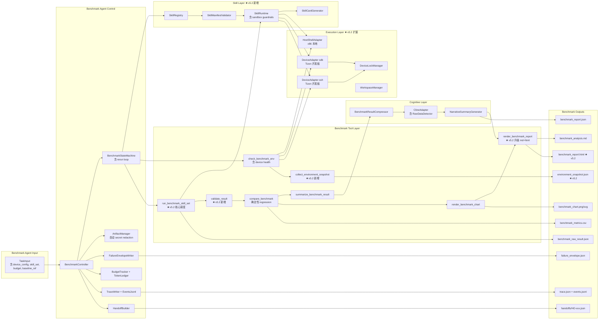
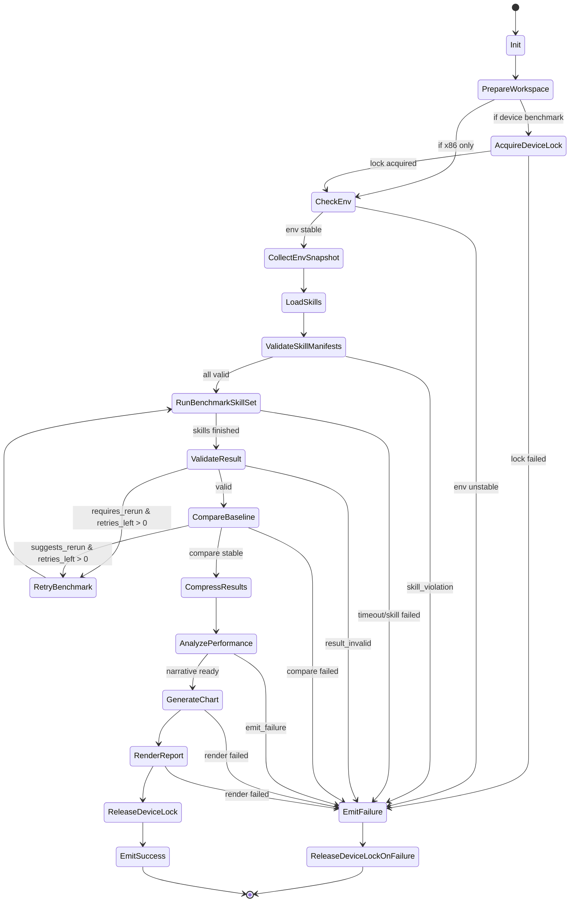
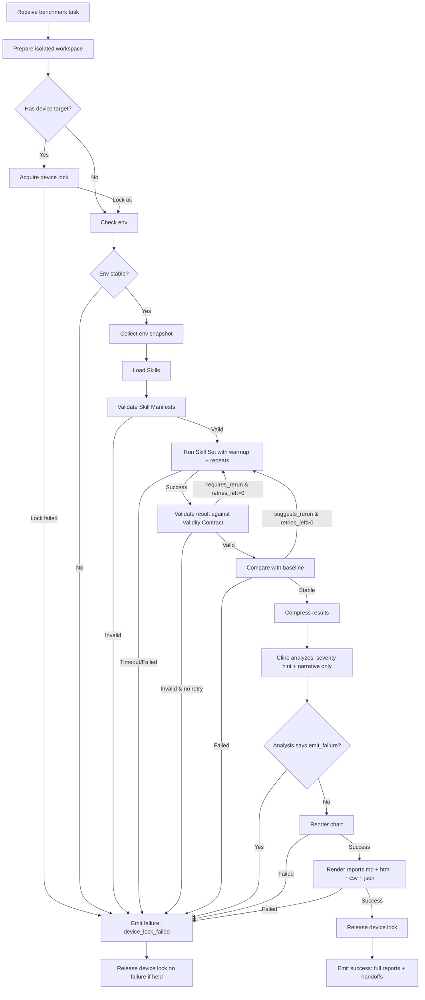

# Benchmark Agent 设计文档 v5.2-RC2.4（Phase 1B 实施候选版，Sprint 0 Spike Gate 启动版）

**版本**：v5.2-RC2.4
**状态**：**Implementation Candidate / Sprint 0 Ready**（仍非 Locked。Phase 1B spike 完成后才升级 Locked）
**关联文档**：
- 《Agent Team Contract v0.7.3》（文档 0，Locked）
- 《Coding System 整体设计方案 v0.4》（文档 1）
- 《Compiler Agent v5.2-RC2.1》（文档 2）
- 《Code Navigation & Evidence Infrastructure v0.3.1》（文档 6，Draft / Spike Required）
- 《Benchmark Skill 框架设计 v0.1》（文档 7，将在批次 2 交付）

**版本历程**：
- v1 → v5.1：6 轮迭代锁定的基础设计
- v5.2：Phase 1B 实施版
- v5.2-RC1：ChatGPT review 修订（rerun 决策位置 / HTML static-only）
- v5.2-RC2：ChatGPT + Kimi 联合 review 修订（B8.2 Controller 骨架补全 rerun 位置 / suggests_rerun 精确化 / 命名对齐 / DeviceLockManager 故障恢复）
- v5.2-RC2.1：ChatGPT + Kimi RC2 review 反馈，文档一致性收尾（B3/B4 图 + Token 字段 + 版本号）
- v5.2-RC2.2：ChatGPT RC2.1 review 反馈，B2 架构图箭头修正
- **v5.2-RC2.3（本版）**：Kimi v0.2 review 反馈，B8.2 Controller `analysis` 变量未初始化潜在 bug 修复

**v5.2-RC2.3 修订摘要**（小修版）：

- **Kimi 指出**：B8.2 Controller 中 `analysis = self.cline_adapter.analyze_benchmark(...)` 在 `while True` 循环外，但循环内的 rerun 路径用 `continue` 跳出，导致 `analysis` 可能在某些边缘场景下保持未初始化。后续 `if analysis.get("decision") == "emit_failure"` 会抛 AttributeError —— B8.2 加 `assert analysis is not None` 断言 + 明确循环退出条件

**v5.2-RC2.3 修订量**：< 100 字，纯代码骨架健壮性修订。

- **v5.2-RC2.4（本版）**：Codex Sprint 0 design review 反馈，AgentResult 的 `token_usage_summary` 字段名 + 子结构与 Team Contract v0.7.3 必填 `token_usage` 不一致 —— 统一为 `token_usage` + `total_in / total_out / by_stage`，以 Contract 为准（Issue 6）

**v5.2-RC2.4 修订量**：< 150 字，AgentResult 字段名对齐 Contract。

---

## 0. v5.2 相对 v5.1 的变更摘要

### 0.1 保留不变（v5.1 核心 100% 继承）

- 状态机设计（B3），含 rerun loop
- 流程图（B4）
- 5 个子能力（B5）
- 统计策略（B1.2）：warmup / repeats ≥ 5 / median / CV
- Tool 设计骨架（B7）
- Cognitive Layer Contract
- FailureEnvelope 内部枚举
- Budget / Timeout Contract
- ExecutionAdapter 接口
- Threshold Policy
- regression 判定回归 Tool 层（v5.1 关键决策保留）

### 0.2 v5.2 新增

| # | 新增内容 | 章节 |
|---|---|---|
| 1 | Phase 1B 范围约束 + Exit Criteria | B1.4、B1.5 |
| 2 | Skill Manifest 框架（runtime-enforced） | B5.1、B7 |
| 3 | Benchmark Validity Contract（重新写入，不依赖 v5.1）| B5.6 |
| 4 | Benchmark Report Contract（md + html + png + csv + json）| B5.7、B6.3 |
| 5 | HostShellAdapter + DeviceAdapter（含 device lock）| B4、B8.2 |
| 6 | Environment Snapshot | B5.6.4 |
| 7 | Token Budget 强制实施 | B6.1.2 |
| 8 | Raw Data Detector（complement Compiler v5.2）| B5.5 |
| 9 | Code Navigation 集成（限定范围）| B5.4 |
| 10 | 完整 benchmark_system.md Prompt 模板 | B12 |
| 11 | Demo 剧本 | B13 |

### 0.3 v5.2 不做的事（推迟到 Phase 1.5）

- gbs / make / autotools 构建
- Memory Infrastructure（跨 task 历史学习）
- Token 自我优化机制
- HTML 报告升级（plotly 交互式 + 历史趋势）
- 跨设备 benchmark 对比
- 共享 device pool（多用户调度）

---

## 1. 通用设计原则（继承 v5.1）

（继承通用 1.1-1.7，此处不重复）

### 1.7 Team-Contract-compliant 原则

Benchmark Agent 严格遵守 Agent Team Contract v0.7.3。所有对外接口（TaskInput / AgentResult / HandoffRequest）使用 Team Contract 定义的 schema。具体对齐项见 v0.7.3 Appendix A。

### 1.8 Phase 1B 范围约束（v5.2 新增）

Phase 1B 目标：**让 Benchmark Agent 能在 x86 / Tizen 开发板上执行可信 benchmark，并输出开发人员能看懂、能复现、能信赖的报告**。

**Phase 1B 明确做的**：
- Skill Manifest + Skill Runtime（用户扩展机制）
- 3-5 个 Skill 示例模板
- HostShellAdapter + DeviceAdapter（sdb + ssh）
- Benchmark Validity Contract 完整实施
- Benchmark Report Contract 完整实施（md + html + png + csv + json）
- Token 追踪 + budget 硬约束
- 配合 Compiler Agent v5.2 完成 performance_verify_requested handoff 闭环

**Phase 1B 明确不做的**：见 0.3 节

---

## 2. 通用关键契约（继承 v5.1，含 v0.7 扩展）

继承 Compiler v5.2 第 2 节定义的 **共享 Base 层**。Benchmark Agent 不重复定义这些组件，直接复用：

- `BaseAgentController` + 异常协议
- `BudgetTracker` + `TokenLedger`
- `ArtifactManager`（含自动 secret redaction）
- `TraceWriter`（同时写 trace.json + events.jsonl）
- `HandoffBuilder`（确定性 hash）
- `FailureEnvelope`（含 Team-level failure_class 扩展）

### 2.1 Benchmark Agent 特有的 FailureEnvelope 枚举

| failure_class | 含义 | 典型 stage |
|---|---|---|
| `unstable_environment` | benchmark 环境不稳定（governor / thermal / load）| `probe_env` |
| `device_unavailable` | 开发板不可用 / 不响应 | `probe_env` |
| `device_lock_failed` | 无法获取 device lock | `probe_env` |
| `benchmark_timeout` | benchmark 执行超时 | `benchmark` |
| `skill_failed` | Skill 运行失败 | `benchmark` |
| `skill_violation` | Skill 违反 Manifest 声明（v5.2 新增）| `benchmark` |
| `compare_failed` | baseline 对比失败 | `compare` |
| `render_failed` | 报告或图表生成失败 | `render` |
| `result_invalid` | benchmark 结果不满足 Validity Contract（v5.2 新增）| `validate` |

含义见 B6.4 节。

### 2.2 stage 枚举扩展

Benchmark Agent stage 枚举（含 v5.2 新增）：

```
probe_env | benchmark | compare | analyze | validate | render | handoff
```

---

## B1. 目标与职责

### B1.1 Phase 1B MVP 范围

**必须支持**：
- Skill 加载与执行（基于 Manifest）
- 在 x86 工作站 + Tizen 开发板上跑 benchmark
- Warmup / repeats / median / CV 完整统计
- baseline 对比 + regression 判定
- 报告生成（md + html + png + csv + json）
- 环境 snapshot 落盘
- Token 追踪 + budget 硬约束

**可选支持**：
- 自动 rerun（最多 1 次）
- 多 Skill 并行（同 task 内不允许并发同一 Skill）

**不支持**（Phase 1.5+）：
- Memory（跨 task 学习历史 benchmark 数据）
- Token 自我优化
- HTML 交互式报告（plotly）
- 历史趋势图
- gbs 构建（如果 benchmark 依赖 gbs build）

### B1.2 统计策略（继承 v5.1，v5.2 重新写入 Validity Contract）

详见 B5.6 Benchmark Validity Contract。**v5.2 不依赖"v5.1 已有"假设**，所有可信度要求在 v5.2 完整重写。

### B1.3 在 Agent Team 中的定位

Benchmark Agent 是 Coding System 中专职**性能基准测试与回归分析**的 Agent：

- **上游典型调用方**（通过 Team Orchestrator 调度）：
  - Compiler Agent 以 `performance_verify_requested` 触发（编译成功后的性能验证）
  - Coding Agent 以 `benchmark_requested` 触发（主动请求性能评估）
  - UT Agent 以 `benchmark_requested` 触发（功能验证通过后的性能补充）
- **下游典型 handoff 目标**：
  - Review Agent（无 regression 或可接受的表现）
  - Coding Agent（发现 regression，需要优化）
  - Human（严重 regression 或环境不稳定，升级人工）

### B1.4 与 Compiler Agent 的关键差异

| 差异点 | Compiler Agent | Benchmark Agent |
|---|---|---|
| 主流程 | 确定性流程 | **含 rerun 循环**（rerun 由 Tool 层确定性判定，**不交给 ClineSR**——v5.2-RC1 修订）|
| 对环境要求 | 能编译即可 | **要求环境稳定**（governor / thermal / load）|
| 副作用 | 修改 workspace | 无 workspace 修改，但占用机器资源（含开发板）|
| 产出多样性 | 主要是 patch | **表 + 图 + 叙述**三件套 |
| 失败处理 | patch 失败即 fail | 噪声大时可 rerun，失败门槛更高 |
| 用户扩展 | 不直接扩展 | **Skill 框架**（用户写 .skill.yaml + .skill.py）|
| 跨设备 | 单一 x86 | **x86 + Tizen 开发板**两个执行域 |

### B1.5 Phase 1B Exit Criteria（v5.2 新增）

Phase 1B 必须通过以下 Exit Criteria 才能进入 Phase 1.5：

**功能完整性**：
- [ ] 至少 3 个 Skill 示例（覆盖 startup / runtime / memory 三类）
- [ ] Skill Manifest 字段全部 runtime-enforced（不只是文档摆设）
- [ ] x86 + Tizen 开发板（sdb + ssh）均跑通至少 1 个 Skill
- [ ] 完整 benchmark 报告产出（md + html + png + csv + json 五种格式）
- [ ] 环境 snapshot 落盘并嵌入报告
- [ ] Token 追踪在 stdout 和 trace 中均可见

**质量**：
- [ ] 单元测试覆盖率 ≥ 80%
- [ ] 集成测试覆盖至少 8 种典型场景（见 B11 节）
- [ ] benchmark 结果在受控环境下可复现（CV ≤ 5% on stable workloads）
- [ ] 报告中 confidence 等级与实际数据一致

**安全与约束**：
- [ ] Raw benchmark output 不直接进 LLM prompt
- [ ] Token budget 在 cline_adapter 层强制
- [ ] Skill 违反 Manifest 声明时触发 `skill_violation` 失败
- [ ] Secret redaction 在 trace + 报告中自动执行
- [ ] Device lock 防止多 task 抢板子

**集成**：
- [ ] 配合 Compiler Agent 的 `performance_verify_requested` 完成 handoff 闭环
- [ ] AgentDescriptor 正确声明 `team_contract_compatibility: ">=0.7,<0.8"`

**Demo**：
- [ ] 在 1 个真实 Tizen 中等规模 repo 上演示完整 benchmark 流程
- [ ] 演示报告对开发人员的可读性（含 environment / confidence / chart）
- [ ] Demo 剧本（B13）执行通过

---

## B2. 架构图



**v5.2-RC2.2 数据流说明**（修订箭头方向后）：

```
TaskInput
  ↓
BenchmarkController
  ↓
[check_benchmark_env + collect_environment_snapshot] (E1, E8)
  ↓
[Skill Layer 加载与验证] (S1 → S2 → S3 → S4)
  ↓
[run_benchmark_skill_set] (E2) ← 通过 S3 调度执行 Skill
  ↓
[validate_result] (E5) ← v5.2-RC2 决策点：requires_rerun
  ↓
[compare_benchmark] (E3) ← v5.2-RC2 决策点：suggests_rerun
  ↓
[summarize_benchmark_result] (E4) ← 压缩为 evidence summary，禁止含 raw log
  ↓
[BenchmarkResultCompressor → ClineAdapter → NarrativeSummaryGenerator] (C1, C2, C3)
  ↓
[render_benchmark_chart] (E6) + [render_benchmark_report] (E7)
  ↓
Artifacts + HandoffRequest
```

关键节点（v5.2-RC2.2 强调）：

- **C1/C2/C3 只在 E3 之后调用一次**：narrative 不参与 rerun 决策
- **E5 / E3 是 rerun 决定点**：retry 由 Tool 层判定，不通过 ClineSR
- **C3 narrative 是 E7 的输入之一**：报告渲染才用 narrative

---

## B3. 状态图



**关键节点**（v5.2-RC2.1 修订）：

- **AcquireDeviceLock**：开发板任务必须先获取 lock
- **ValidateSkillManifests**：Skill 加载后 runtime enforce Manifest 声明
- **ValidateResult**：检查 result 是否满足 Benchmark Validity Contract；**`requires_rerun=true` 触发 rerun**（Tool 层确定性决定）
- **CompareBaseline**：除了产出对比表，还判断 `suggests_rerun`；**suggests_rerun=true 触发 rerun**（Tool 层确定性决定，同一 metric breached AND variance_flag）
- **AnalyzePerformance**：ClineSR 只做 narrative + severity hint，**不再控制 rerun**（v5.2-RC2.1 状态图同步 B5.2.1/B8.2 设计）
- **ReleaseDeviceLock**：无论成败必须释放 lock

---

## B4. 流程图



---

## B5. 核心能力定义（v5.2 修订）

### B5.1 Skill Manifest 与 Skill Runtime（v5.2 核心新增）

Benchmark Agent 在 Phase 1B 引入用户扩展机制——**Skill**。详细规范见**新增文档 07《Benchmark Skill 框架设计》**，本节列出与 Benchmark Agent 集成相关的核心规则。

#### B5.1.1 Skill 三要素

每个 Skill 由 3 个组件构成：

1. **Manifest**（`skill.yaml`）：runtime-enforced contract
2. **Implementation**（`skill.py`）：具体执行代码
3. **Card**（自动生成）：给 LLM 看的精简描述

#### B5.1.2 Manifest 字段（核心）

```yaml
# skill.yaml
skill_id: video_player_startup            # 必填，全局唯一
version: 1.0.0                             # 必填，semver
description: "测量 Tizen 视频播放器冷启动时间"

target_platforms:                          # 必填
  - x86                                    # 或 tizen_device
  - tizen_device

required_permissions:                      # 必填
  - device.shell                           # 在开发板执行 shell 命令
  - device.push                            # 推文件到开发板
  - device.pull                            # 从开发板拉文件
  - host.shell                             # 在 x86 执行 shell
  - host.read_workspace                    # 读 workspace
  # network 默认禁用，需显式声明 network: true

timeout_sec: 300                           # 必填，单次 run 最大耗时
warmup_repeats: 1                          # 选填，默认 1
repeats: 5                                 # 选填，默认 5
retries: 1                                 # 选填，默认 0

metrics:                                   # 必填，metric schema
  startup_time_ms:
    type: number
    unit: ms
    lower_is_better: true
    threshold_regression_percent: 5.0

artifacts:                                 # 选填
  - logcat
  - perf_report

side_effects:                              # 选填
  - launch_app                             # 启动 app
  - clear_cache                            # 清空缓存
  - reboot_device                          # 重启设备（高风险，必须显式声明）

cleanup_required: true                     # 必填
network: false                             # 默认 false
allowed_commands:                          # 选填，命令 allowlist
  - "/usr/bin/sdb"
  - "/usr/bin/ssh"
denied_commands:                           # 选填，命令 denylist
  - "rm -rf /"
  - "dd if=/dev/zero"
```

#### B5.1.3 Skill Implementation 接口

```python
# skill.py
from benchmark_skill_sdk import BenchmarkSkill, SkillContext, RunResult

class VideoPlayerStartupSkill(BenchmarkSkill):
    """对应 skill.yaml 中声明的 skill_id=video_player_startup"""

    def setup(self, ctx: SkillContext) -> None:
        """准备测试环境。允许的操作：根据 Manifest required_permissions"""
        ctx.device.shell("am force-stop com.samsung.videoplayer")
        ctx.device.push(ctx.workspace / "test_video.mp4", "/tmp/test_video.mp4")

    def run(self, ctx: SkillContext) -> RunResult:
        """跑一次测试。返回 metrics 必须匹配 Manifest 中 metrics 声明。"""
        start = ctx.now_ms()
        ctx.device.shell("am start com.samsung.videoplayer /tmp/test_video.mp4")
        ctx.wait_for_event("video_player.started", timeout_sec=10)
        elapsed = ctx.now_ms() - start
        return RunResult(metrics={"startup_time_ms": elapsed})

    def teardown(self, ctx: SkillContext) -> None:
        """清理。必须实现（Manifest cleanup_required: true）。"""
        ctx.device.shell("am force-stop com.samsung.videoplayer")
        ctx.device.shell("rm -f /tmp/test_video.mp4")
```

#### B5.1.4 Skill Card（给 LLM）

由系统从 Manifest 自动生成，不含 Python 源码：

```text
Skill: video_player_startup (v1.0.0)
Purpose: 测量 Tizen 视频播放器冷启动时间
Inputs: implicit (test_video.mp4 in workspace)
Outputs:
  - startup_time_ms (number, ms, lower is better, regression threshold 5%)
Platform: tizen_device
Side effects: launches app, clears cache (cleanup required)
Timeout: 300s
Stats: warmup=1, repeats=5
```

LLM 在分析 benchmark 结果时只看到 Card，**不会**看到完整的 `.skill.py` 源码（避免 token 爆炸 + 安全风险）。

#### B5.1.5 Skill Runtime Guardrails

Skill Runtime（实现见文档 07）必须 enforce 以下规则：

| Guardrail | 实施方式 |
|---|---|
| Workspace 路径隔离 | Skill 通过 `ctx.workspace` 访问，不能用绝对路径 |
| Command allowlist | `ctx.device.shell()` / `ctx.host.shell()` 内部校验命令是否在 Manifest 允许范围 |
| Permission enforcement | `ctx.device.*` 调用前检查 `required_permissions` |
| Timeout kill | 整体 timeout_sec 由 SkillRuntime 监控，超时强制 SIGKILL |
| Env redaction | `ctx.env` 中敏感环境变量预先 redact |
| No arbitrary FS write | Skill 写入限于 workspace 子目录 |
| Network gating | Manifest 未声明 network: true 时禁止网络访问 |
| Destructive action gating | 涉及 reboot / format / wipe 的命令必须在 side_effects 中显式声明 |
| Trace recording | 每条 shell 命令、文件操作、网络请求自动记录到 trace |
| Teardown guarantee | 即使 run() 抛异常，teardown() 仍然执行 |

**违反 Guardrail 的 Skill**：抛 `SkillViolationError`，转成 `skill_violation` FailureEnvelope，**不影响其他 Skill**。

### B5.2 Benchmark 运行（v5.2 修订）

通过 `run_benchmark_skill_set` Tool 协调 Skill 执行：

```
for each skill in skill_set:
    1. Validate manifest
    2. Load skill module
    3. for warmup_idx in range(warmup_repeats):
        skill.setup(ctx)
        skill.run(ctx)      # warmup，结果丢弃
        skill.teardown(ctx)
    4. results = []
    for repeat_idx in range(repeats):
        skill.setup(ctx)
        result = skill.run(ctx)
        skill.teardown(ctx)
        results.append(result)
    5. Aggregate results (median, mean, std, cv, outliers)
```

### B5.2.1 Rerun 决策位置（v5.2-RC1 修订：从 ClineSR 移到 Tool 层）

**v5.2 原设计**：ClineSR 在 AnalyzePerformance 阶段返回 `decision="rerun"` 触发 RetryBenchmark。

**v5.2-RC1 修订理由**：ChatGPT review 指出"rerun 是确定性判断（CV 阈值、outlier 数量、环境稳定性），不应该由 LLM 决定。否则相同数据可能因为 LLM 判断不同导致 replay 不稳定"。这违反 Cognitive Boundary 原则（确定性判断必须由 Code 做）。

**v5.2-RC1 rerun 决策架构**：

| 阶段 | 谁决定 rerun | 触发条件（确定性规则） |
|---|---|---|
| `validate_result` Tool | 必须 rerun（result_invalid 时） | repeats < 3、所有样本都是 outlier、metric 缺失 |
| `compare_benchmark` Tool | 建议 rerun（variance_flag 时） | CV > max_cv_percent、outlier > 阈值、环境 snapshot 显示开发板状态异常 |
| Controller | 决定是否真的 rerun（基于 retries_left） | retries_left > 0 且任一 Tool 建议 rerun |
| **ClineSR** | **不决定 rerun**（只做 narrative）| —— |

**关键规则**：

1. **rerun 决定不是 LLM 的输出**：ClineSR 输出 schema 中**移除** `decision="rerun"` 选项
2. **ClineSR 只能 hint**：可在 `narrative_summary` 中提到"variance is high, consider rerun"，**但不是控制信号**
3. **rerun 触发由 Controller 基于 Tool 输出做**：
   ```
   if (validate_result.requires_rerun OR compare_benchmark.suggests_rerun) 
      AND retries_left > 0:
      goto RetryBenchmark
   ```
4. **rerun 的确定性触发条件**（写入 Tool 实现）：
   - `validate_result.requires_rerun = true` ⇔ 任一 metric 的 confidence = "invalid"
   - `compare_benchmark.suggests_rerun = true` ⇔ **同一个 metric** 同时满足 `variance_flag = true` AND `breached = true`（v5.2-RC2 精确化）
   - 注意：**不是**"任意两个 metric 分别满足一个条件"。例如：
     - metric A: breached=true, variance_flag=false → 不触发 suggests_rerun
     - metric B: breached=false, variance_flag=true → 不触发 suggests_rerun
     - metric C: breached=true, variance_flag=true → **触发** suggests_rerun
   - 实现：`suggests_rerun = any(m.breached and m.variance_flag for m in metrics)`
5. **replay-safe 保证**：相同 raw_result + baseline + threshold 总是得到相同的 rerun 决定

**v5.2-RC1 状态图修订**：

```
B3 状态图原版：AnalyzePerformance --> RetryBenchmark : rerun & budget ok
B3 状态图 RC1：CompareBaseline --> RetryBenchmark : suggests_rerun & retries_left > 0
              ValidateResult  --> RetryBenchmark : requires_rerun & retries_left > 0
              AnalyzePerformance (ClineSR narrative only)
```

**v5.2-RC1 Controller 骨架修订**（B8 章节会反映）：rerun 判断**从 cline 调用之后移到 cline 调用之前**。

**对 ClineSR prompt 的影响**：

- B12 节 prompt 模板中**移除** `decision: "rerun"` 选项
- ClineSR 只输出 `decision: "emit_success" | "emit_failure"` + `narrative_summary` + `regression_severity_hint`

### B5.3 Baseline 对比（继承 v5.1 修订）

`compare_benchmark` Tool 的职责（保持 v5.1 设计）：

```yaml
Tool: compare_benchmark
输入:
  - baseline_ref: ArtifactRef
  - current_result_ref: ArtifactRef
  - threshold_policy: dict
规则:
  - 聚合方法：默认 median
  - 计算每个 metric 的 delta_percent 和 cv_percent
  - 确定性 regression 判定（基于阈值）
  - 计算 breached_metrics
  - 计算 variance_flags
输出:
  - ok: bool
  - metrics_table: dict
  - regression: bool                  # ← 来自 Tool 确定性判定
  - breached_metrics: [str]
  - variance_flags: [str]
  - error_message: str | null
```

**Cognitive Boundary 体现**：regression true/false 由 Tool 输出，不交给 ClineSR。

### B5.4 Code Navigation 集成（v5.2 新增，限定范围）

Benchmark Agent 的 Code Navigation 集成**比 Compiler Agent 简单**：

- 用于 ClineSR 分析 regression 时**辅助理解**哪些代码改动可能导致性能变化
- 输入是 `change_diff`（如果上游 Compiler / Coding 提供），输出是受影响的函数/类列表
- 不强依赖：没有 Code Navigation 也能完成 benchmark 分析（只是 ClineSR 上下文少一些）

集成点：

```python
# 在 AnalyzePerformance stage 调用（如果有 change_diff）
if task.payload.get("change_diff_ref"):
    code_nav_result = code_navigation.find_affected_symbols(
        diff_ref=task.payload["change_diff_ref"],
        max_results=20,
    )
    prior_context["change_impact_scope"] = code_nav_result
```

### B5.5 Raw Data Detector（v5.2 新增，complement Compiler）

类似 Compiler Agent v5.2 的 Raw Log Detector，Benchmark Agent 在 `cline_adapter` 层检查：

- benchmark 原始输出（logcat / perf 报告 / strace 等）禁止直接进入 prompt
- 必须经过 `summarize_benchmark_result` Tool 压缩为结构化摘要
- 违反时抛 `RawDataInPromptError`，转成 `raw_data_leakage` FailureEnvelope（v5.2-RC2 命名对齐 Team Contract 2a.2）
- **v5.2-RC2 命名变化**：原 `raw_log_in_prompt_violation` 改为 `raw_data_leakage`，与 Team Contract 5.6 / 2a.2 / Compiler A11 统一
- **允许例外**：bounded + redacted + source-linked 的 log_excerpt 在 EvidencePacket 内可通过 RawDataDetector（详见 Team Contract 5.6.2）

### B5.6 Benchmark Validity Contract（v5.2 完整重写，不依赖 v5.1）

**这是 v5.2 的核心新增之一**。Benchmark Agent 输出的结果必须满足以下条件才能视为有效。

#### B5.6.1 统计要求

| 项 | 默认值 | 最小值 | 说明 |
|---|---|---|---|
| `warmup_repeats` | 1 | 1 | 至少 1 次 warmup，丢弃结果 |
| `repeats` | 5 | 3 | 实际采样次数 |
| `aggregation` | median | — | 主指标用中位数 |
| `secondary_stats` | mean, std, cv | — | 报告中必含 |
| `outlier_policy` | mad_based | — | MAD-based outlier detection |
| `max_cv_percent` | 5.0 | — | 单 metric CV 超过则标 `variance_flag` |

`repeats < 3` 视为 invalid，直接 `result_invalid`。

#### B5.6.2 Outlier Policy

使用 **MAD-based**（Median Absolute Deviation）outlier detection：

```python
median = np.median(samples)
mad = np.median(np.abs(samples - median))
threshold = 3.5  # 默认值，可配置
outliers = [s for s in samples if abs(s - median) > threshold * mad]
```

被识别为 outlier 的样本**不影响主 aggregation**，但在报告中**显式列出**。

#### B5.6.3 Confidence 等级

每个 metric 自动计算 confidence 等级，作为报告输出的一部分：

| Confidence | 条件 |
|---|---|
| `high` | repeats ≥ 5, cv ≤ 3%, 0 outliers |
| `medium` | repeats ≥ 5, cv ≤ 5%, ≤ 1 outlier |
| `low` | repeats ≥ 3, cv ≤ 10%, ≤ 2 outliers |
| `invalid` | 任一条件未满足（触发 `result_invalid` 失败） |

#### B5.6.4 Environment Snapshot（v5.2 必填）

每次 benchmark task 必须落盘 `environment_snapshot.json`：

```json
{
  "task_id": "BMK-000077",
  "captured_at": "2026-04-22T12:00:00Z",
  "host": {
    "os": "Ubuntu 22.04",
    "kernel": "5.15.0-78-generic",
    "cpu_model": "Intel(R) Xeon(R) Gold 6248",
    "cpu_cores": 40,
    "memory_gb": 128,
    "load_average": [0.8, 0.6, 0.5]
  },
  "device": {
    "model": "TM1-12345",
    "tizen_version": "7.0",
    "image_version": "20260315-build123",
    "kernel": "...",
    "cpu_governor": "performance",
    "thermal_state": "normal",
    "battery_level": 85,
    "available_memory_mb": 1024,
    "background_processes": [...],
    "sdb_version": "4.2.18",
    "connection_type": "sdb"
  },
  "code": {
    "git_commit": "abc123def456...",
    "git_branch": "main",
    "git_dirty": false,
    "build_target": "video_player_lib",
    "build_mode": "release"
  },
  "skill_set": [
    {
      "skill_id": "video_player_startup",
      "version": "1.0.0",
      "manifest_hash": "sha256:..."
    }
  ]
}
```

**用途**：
- 报告头部显示，让开发人员判断结果可信度
- 与 baseline 对比时帮助识别环境差异
- replay-safe 验证（同一 environment 下重跑应得到相近结果）

#### B5.6.5 Reproduce Command

报告必须包含**复现命令**（用户拿到结果可以原样复现）：

```bash
# Reproduce this benchmark:
$ benchmark-agent run \
    --skill video_player_startup@1.0.0 \
    --device sdb://TM1-12345 \
    --image 20260315-build123 \
    --warmup 1 --repeats 5 \
    --baseline BMK-000042
```

### B5.7 Benchmark Report Contract（v5.2 新增）

详细规范见 B6.3 节。核心要求：

- **5 种格式同时产出**：md / html / png / csv / json
- 报告含固定章节顺序：Summary → Environment → Metrics Table → Regression → Confidence → Chart → Raw Artifacts → Reproduce
- Markdown / HTML 使用**相对路径**引用图片，**禁止 base64 嵌入**

---

## B6. 输入输出定义（v5.2 修订）

### B6.1 TaskInput

对齐 Team Contract 6.2：

```json
{
  "task_id": "BMK-000077",
  "parent_task_id": "CMP-000124",
  "agent_type": "benchmark",
  "incoming_handoff_id": "HO-a1b2c3d4",
  "payload": {
    "skill_set": [
      {
        "skill_id": "video_player_startup",
        "version": "1.0.0",
        "config": {}
      }
    ],
    "baseline_ref": {
      "type": "artifact_ref",
      "task_id": "BMK-000042",
      "relative_path": "raw/benchmark_raw_result.json",
      "schema": "benchmark_raw_result.v1",
      "content_hash": "sha256:..."
    },
    "workspace_snapshot": {
      "type": "local_path",
      "value": "/workspace/repo"
    },
    "change_diff_ref": {
      "type": "artifact_ref",
      "task_id": "CMP-000124",
      "relative_path": "patches/applied.diff",
      "schema": "unified_diff.v1",
      "content_hash": "sha256:..."
    },
    "device_config": {
      "backend": "sdb",
      "device_id": "TM1-12345",
      "ssh_host": null,
      "ssh_user": null,
      "ssh_key_path": null
    },
    "env_profile": "tizen-7.0-tm1",
    "threshold_policy": {
      "default_regression_percent": 5.0,
      "max_cv_percent": 5.0,
      "aggregation": "median",
      "per_metric_overrides": {
        "startup_time_ms": 5.0,
        "peak_memory_mb": 3.0
      }
    },
    "routing_policy": {
      "on_no_regression_target": "REV",
      "on_regression_target": "CDN",
      "on_severe_regression_target": "HUMAN",
      "severe_regression_threshold_percent": 20.0
    }
  },
  "constraints": {
    "budget": {
      "total_agent_timeout_sec": 2400,
      "benchmark_timeout_sec": 1200,
      "cline_timeout_sec": 120,
      "max_tokens_per_task": 25000,
      "evidence_packet_max_tokens": 4000,
      "max_tokens_per_call_in": 4000,
      "max_tokens_per_call_out": 1000
    },
    "deadline_iso": "2026-04-22T14:00:00Z"
  }
}
```

### B6.1.1 device_config 字段

| 字段 | 类型 | 必填 | 说明 |
|---|---|---|---|
| `backend` | string | yes | `"sdb"` / `"ssh"` / `"none"` |
| `device_id` | string | conditional | sdb 必填 |
| `ssh_host` | string | conditional | ssh 必填 |
| `ssh_user` | string | conditional | ssh 必填 |
| `ssh_key_path` | string | conditional | ssh 必填 |

当所有 Skill 的 `target_platforms` 都是 `x86` 时，`backend` 可设为 `"none"`，不获取 device lock。

### B6.1.2 Token Budget 字段（v5.2 详细说明）

继承 Compiler v5.2 同名字段含义：

| 字段 | 含义 | 触发条件 |
|---|---|---|
| `max_tokens_per_task` | task 总 token 上限 | 累计超过即 `token_budget_exceeded` |
| `evidence_packet_max_tokens` | 单 evidence packet 上限 | benchmark 摘要超过即压缩或失败 |
| `max_tokens_per_call_in` | 单次 LLM 调用 input 上限 | cline_adapter 拒绝并失败 |
| `max_tokens_per_call_out` | 单次 LLM 调用 output 上限 | cline_adapter 截断或失败 |

**默认值**（如 TaskInput 未指定）：

```python
DEFAULT_TOKEN_BUDGET = {
    "max_tokens_per_task": 25000,
    "evidence_packet_max_tokens": 4000,
    "max_tokens_per_call_in": 4000,
    "max_tokens_per_call_out": 1000,
}
```

### B6.1.3 routing_policy 字段

| 字段 | 类型 | 默认值 | 说明 |
|---|---|---|---|
| `on_no_regression_target` | string | `"REV"` | 无 regression 时下游 Agent |
| `on_regression_target` | string | `"CDN"` | 检测到 regression 时下游 Agent |
| `on_severe_regression_target` | string | `"HUMAN"` | 严重 regression 升级到人工 |
| `severe_regression_threshold_percent` | float | `20.0` | 超过此阈值视为 severe |

### B6.2 AgentResult

对齐 Team Contract 6.3：

```json
{
  "task_id": "BMK-000077",
  "status": "success",
  "agent_type": "benchmark",
  "primary_artifact": {
    "type": "artifact_ref",
    "task_id": "BMK-000077",
    "relative_path": "reports/benchmark_report.json",
    "schema": "benchmark_report.v1",
    "content_hash": "sha256:..."
  },
  "all_artifacts": [
    { "...": "benchmark_report.json (primary)" },
    { "...": "benchmark_metrics.csv" },
    { "...": "benchmark_analysis.md" },
    { "...": "benchmark_report.html ★ v5.2" },
    { "...": "benchmark_chart.png" },
    { "...": "benchmark_raw_result.json" },
    { "...": "environment_snapshot.json ★ v5.2" }
  ],
  "failure_envelope": null,
  "outgoing_handoffs": [
    {
      "type": "artifact_ref",
      "task_id": "BMK-000077",
      "relative_path": "handoffs/HO-e5f6g7h8.json",
      "schema": "handoff_request.v1",
      "content_hash": "..."
    }
  ],
  "trace_ref": {
    "type": "artifact_ref",
    "task_id": "BMK-000077",
    "relative_path": "trace.json",
    "schema": "trace.v1",
    "content_hash": "..."
  },
  "token_usage": {
    "total_in": 8200,
    "total_out": 1100,
    "by_stage": {
      "analyze": {"in": 8200, "out": 1100}
    }
  }
}
```

> **v5.2-RC2.4 修订**（Codex Sprint 0 design review Issue 6）：原字段名 `token_usage_summary` 与子字段 `total_tokens_in / total_tokens_out / cost_estimate_usd` 与 Team Contract v0.7.3 AgentResult 必填的 `token_usage`（子字段 `total_in / total_out / by_stage`）不一致。**以 Contract 为准**，统一为 `token_usage` + `total_in / total_out / by_stage`。Benchmark Agent 通常只有 analyze 一个 LLM 阶段（narrative 生成），故 `by_stage` 只含 analyze。`cost_estimate_usd` 不在 Contract 必填 schema 内，如需保留可放 trace metadata，不放 AgentResult。

### B6.3 Benchmark Report Contract（v5.2 完整定义）

#### B6.3.1 五种格式产出

| 格式 | 文件 | 用途 |
|---|---|---|
| JSON | `reports/benchmark_report.json` | 结构化数据（机器读）|
| CSV | `reports/benchmark_metrics.csv` | 用 Excel/Numbers 打开 |
| PNG | `reports/charts/*.png` | 静态图表 |
| Markdown | `reports/benchmark_analysis.md` | 人类可读，带嵌入图 |
| **HTML** | `reports/benchmark_report.html` | **★ v5.2 必须**，浏览器打开、可截图、可转发 |

#### B6.3.2 Markdown 模板（必须遵循）

```markdown
# Benchmark Report: {task_id}

**Status**: completed
**Generated**: {timestamp}
**Confidence**: high / medium / low

## Summary

{1-3 句 narrative summary}

**Verdict**: ✅ No regression / ⚠️ Regression detected / ❌ Severe regression

## Environment

| Field | Value |
|---|---|
| Host OS | {host.os} |
| Device | {device.model} ({device.tizen_version}) |
| Image | {device.image_version} |
| Git Commit | {code.git_commit[:8]} |
| ... | ... |

完整快照: [environment_snapshot.json](environment_snapshot.json)

## Metrics

| Metric | Baseline | Current | Delta | Threshold | Status | Confidence |
|---|---|---|---|---|---|---|
| startup_time_ms | 820 | 910 | +10.9% | 5% | 🔴 | medium |
| peak_memory_mb | 245 | 248 | +1.2% | 3% | 🟢 | high |

## Regression Analysis

{LLM narrative analysis based on Cognitive Layer Contract}

**Affected scope** (from Code Navigation):
- `src/video_player/decoder.cc`: 2 functions
- `src/video_player/renderer.cc`: 1 function

## Confidence & Noise

| Metric | Repeats | Mean | Median | Std | CV | Outliers Removed |
|---|---|---|---|---|---|---|
| startup_time_ms | 5 | 912 | 910 | 18 | 2.0% | 1 |
| peak_memory_mb | 5 | 248 | 248 | 2 | 0.8% | 0 |

## Charts


## Raw Artifacts

- [benchmark_report.json](benchmark_report.json)
- [benchmark_metrics.csv](benchmark_metrics.csv)
- [benchmark_raw_result.json](benchmark_raw_result.json)
- [environment_snapshot.json](environment_snapshot.json)
- [Full trace](trace.json)

## Reproduce

```bash
benchmark-agent run \
    --skill video_player_startup@1.0.0 \
    --device sdb://TM1-12345 \
    --image 20260315-build123 \
    --warmup 1 --repeats 5 \
    --baseline BMK-000042
```
```

#### B6.3.3 HTML 模板（v5.2-RC1 强化：static HTML only）

**v5.2-RC1 强化约束**（针对 ChatGPT review "别引入复杂前端栈"）：

Phase 1B HTML 必须满足以下**全部**约束：

| 约束 | 必须 |
|---|---|
| 静态 HTML，无 JavaScript framework | ✅ React / Vue / Angular 都不允许 |
| 无外部 CDN 依赖 | ✅ 不引用任何远程 CSS / JS / font |
| CSS 必须 embedded（`<style>` 内联或 inline style）| ✅ 不允许外部 .css 文件 |
| Charts 用相对路径引用 PNG / SVG | ✅ 不引入 plotly / d3 / chart.js |
| 不使用 base64 嵌入图片 | ✅ 图片用相对路径，避免单文件膨胀 |
| 所有链接用相对路径 | ✅ 便于复制 / 转发整个 reports 目录 |
| 渲染依赖：浏览器原生 HTML5 + CSS3 | ✅ 可在任何浏览器、任何环境打开 |
| 文件大小目标 | < 100 KB（不含图片）|

**实现方式**：

- 使用 Jinja2 模板（Python 端渲染）
- 模板只输出 `<html><head><style>...</style></head><body>...</body></html>`
- 输出 file：`reports/benchmark_report.html`，与 `reports/charts/*.png` 同目录

**禁止的实施方式**：

- 不引入 plotly / d3 / chart.js / highcharts 等图表库
- 不引入 Bootstrap / Tailwind / Material-UI 等 CSS 框架
- 不使用 web font（system font 优先）
- 不使用 fetch / XHR 加载外部资源

**Phase 1.5 升级路线**：

- 引入 plotly / vega-lite 实现交互式图表（缩放、过滤、悬停 tooltip）
- 引入历史趋势图（跨多次 benchmark 的折线图）
- 引入对比模式（多 baseline 同时比较）

**这些都不在 Phase 1B 范围内**。

#### B6.3.4 Chart 类型

Phase 1B 必须产出：

| 图表类型 | 用途 |
|---|---|
| `comparison_{metric}.png` | baseline vs current 柱状图 |
| `distribution_{metric}.png` | 多次 repeat 的分布（box plot 或 strip plot）|

Phase 1.5 可选：trend chart（跨多次 benchmark 的趋势图）。

### B6.4 benchmark_report.json schema

```json
{
  "task_id": "BMK-000077",
  "status": "completed",
  "skill_set": [
    {"skill_id": "video_player_startup", "version": "1.0.0"}
  ],
  "baseline": "BMK-000042",
  "current": "HEAD@feature_branch",
  "regression": true,
  "regression_severity": "medium",
  "verdict": "regression_detected",
  "metrics": {
    "startup_time_ms": {
      "baseline_median": 820,
      "current_median": 910,
      "delta_percent": 10.9,
      "threshold_percent": 5.0,
      "breached": true,
      "cv_percent": 2.0,
      "confidence": "medium",
      "samples": [905, 910, 908, 920, 1020],
      "outliers_removed": [1020],
      "secondary_stats": {
        "mean": 912,
        "std": 18,
        "min": 905,
        "max": 920
      }
    }
  },
  "recommended_next_action": "route_to_review_or_coding",
  "environment_snapshot_ref": {
    "type": "artifact_ref",
    "task_id": "BMK-000077",
    "relative_path": "environment_snapshot.json",
    "schema": "environment_snapshot.v1",
    "content_hash": "..."
  },
  "failure_envelope_path": null,
  "reproduce_command": "benchmark-agent run --skill ..."
}
```

### B6.5 枚举定义

- `benchmark_report.status ∈ {"completed", "failed"}`
- `regression_severity ∈ {"none", "low", "medium", "high", "severe"}`
- `verdict ∈ {"no_regression", "regression_detected", "severe_regression", "inconclusive"}`
- `recommended_next_action ∈ {"route_to_review", "route_to_review_or_coding", "route_to_coding", "manual_followup", "emit_success"}`

**severity 计算规则**（继承 v5.1）：

- `none`：regression=false
- `severe`：任何 metric `delta_percent > severe_regression_threshold_percent`（确定性规则）
- `low / medium / high`：ClineSR 叙述性判断
- LLM hint 非法时 fallback 为 `medium`

### B6.6 HandoffRequest 输出

| 情况 | reason | target | priority |
|---|---|---|---|
| 无 regression | `benchmark_passed` | `on_no_regression_target`（默认 REV）| `normal` |
| 检测到 regression（非 severe）| `regression_detected` | `on_regression_target`（默认 CDN）| `normal` |
| Severe regression | `regression_detected` | `on_severe_regression_target`（默认 HUMAN）| `high` |
| ClineSR `emit_failure`（inconclusive）| `regression_detected` | `on_severe_regression_target` | `high` |
| Env / device / timeout / compare / render 失败 | 无 handoff | — | — |

---

## B7. Tool 设计

### Tool: check_benchmark_env

**职责**：检查 benchmark 环境稳定性（含 device 健康）。

**输入**：`workspace`、`env_profile`、`device_config`

**输出**：
```json
{
  "env_stable": true,
  "host_status": {"cpu_load": 0.8, "memory_available_mb": 8192},
  "device_status": {
    "connected": true,
    "cpu_governor": "performance",
    "thermal_state": "normal",
    "available_memory_mb": 1024,
    "background_load_score": 0.1
  },
  "notes": ["device thermal margin OK", "CPU governor properly set"]
}
```

**失败条件**（任一触发 `env_stable: false`）：
- host load > 阈值
- device 未连接
- device CPU governor 不是 performance
- thermal_state ∈ {warm, hot, critical}
- device memory 不足

### Tool: collect_environment_snapshot（v5.2 新增）

**职责**：采集完整 environment_snapshot.json（见 B5.6.4）

**输入**：`workspace`、`device_config`

**输出**：`{snapshot_ref: ArtifactRef}`

### Tool: run_benchmark_skill_set（v5.2 重新设计）

**职责**：调度执行 Skill 集合。

**输入**：
- `skills`: 已加载并验证的 Skill 实例列表
- `device_adapter`: 选定的 DeviceAdapter（或 None）
- `host_adapter`: HostShellAdapter
- `warmup_repeats`: 全局 warmup 次数
- `repeats`: 全局 repeats 次数（Skill manifest 中可覆盖）
- `timeout_sec`: 整体超时

**输出**：
```json
{
  "ok": true,
  "raw_result_ref": ArtifactRef,
  "per_skill_results": {
    "video_player_startup": {
      "samples": [...],
      "metrics_collected": {...}
    }
  },
  "timed_out": false,
  "skill_failures": []
}
```

**Skill Runtime 集成**：本 Tool 内部使用 SkillRuntime 调度每个 Skill 的 setup/run/teardown，并 enforce Manifest Guardrails。

### Tool: validate_result（v5.2 新增）

**职责**：检查 benchmark 结果是否满足 Benchmark Validity Contract（B5.6）。

**输入**：
- `raw_result_ref`: benchmark 原始结果
- `validity_contract`: 配置（默认值见 B5.6.1）

**输出**：
```json
{
  "ok": true,
  "metrics_validity": {
    "startup_time_ms": {
      "valid": true,
      "confidence": "medium",
      "reasons": []
    }
  },
  "global_valid": true,
  "violations": []
}
```

任一 metric `confidence == "invalid"` 触发 `result_invalid` 失败。

### Tool: compare_benchmark

继承 v5.1 设计（确定性 regression 判定）。

**输入**：`baseline_ref` (ArtifactRef), `current_result_ref` (ArtifactRef), `threshold_policy`

**输出**：`{ok, metrics_table, regression, breached_metrics, variance_flags}`

### Tool: summarize_benchmark_result

**职责**：把 raw_result + compare_result 压缩成 LLM 可读的 evidence summary。

**关键约束**：输出 ≤ `evidence_packet_max_tokens`，不含 raw logcat / perf 数据。

### Tool: render_benchmark_chart

**职责**：生成 PNG 图表。

**输入**：`metrics_table`, `task_id`, `chart_types`

**输出**：`{ok, chart_refs: [ArtifactRef]}`

Phase 1B 实现：
- `comparison_{metric}.png`：matplotlib 柱状图（baseline vs current）
- `distribution_{metric}.png`：matplotlib box plot 或 strip plot

### Tool: render_benchmark_report

**职责**：生成 md / html / csv / json 四种报告。

**输入**：
- `task_id`
- `metrics_table`
- `chart_refs`
- `environment_snapshot_ref`
- `analysis`（来自 ClineSR narrative）
- `benchmark_validity`（来自 validate_result）

**输出**：
```json
{
  "ok": true,
  "report_md_ref": ArtifactRef,
  "report_html_ref": ArtifactRef,
  "metrics_csv_ref": ArtifactRef,
  "report_json_ref": ArtifactRef,
  "error_message": null
}
```

---

## B8. 代码骨架

### B8.1 目录结构

```
agents/
  base/                                  # 共享 Base 层（与 Compiler v5.2 同）

  benchmark_agent/
    benchmark_controller.py
    benchmark_states.py
    benchmark_descriptor.py
    role_profile.yaml
    prompts/
      benchmark_system.md                # 见 B12

  skill_runtime/                         # ★ v5.2 新增（详见文档 07）
    skill_loader.py
    skill_runtime.py
    manifest_validator.py
    skill_card_generator.py
    guardrails.py
    skill_context.py

tools/
  benchmark/
    check_benchmark_env.py
    collect_environment_snapshot.py      # ★ v5.2 新增
    run_benchmark_skill_set.py           # ★ v5.2 重新设计
    validate_result.py                   # ★ v5.2 新增
    compare_benchmark.py
    summarize_benchmark_result.py
    render_benchmark_chart.py
    render_benchmark_report.py           # ★ v5.2 升级（md+html+csv+json）
    baseline_resolver.py

infra/
  execution/
    host_shell_adapter.py
    device_adapter_sdb.py
    device_adapter_ssh.py
    device_lock_manager.py               # ★ v5.2 新增

schemas/
  benchmark_report.schema.json
  benchmark_raw_result.schema.json
  benchmark_metrics.schema.json
  benchmark_analysis.schema.json
  environment_snapshot.schema.json       # ★ v5.2 新增
  skill_manifest.schema.json             # ★ v5.2 新增（也在文档 07）

user_skills/                             # ★ v5.2 新增（用户写）
  examples/
    cpu_microbench/
      skill.yaml
      skill.py
    memory_alloc_perf/
      skill.yaml
      skill.py
    file_io_throughput/
      skill.yaml
      skill.py
```

### B8.2 BenchmarkController 骨架

```python
from agents.base.base_agent_controller import (
    BaseAgentController, AgentResult, ArtifactRef,
)
from agents.skill_runtime import SkillRegistry, SkillRuntime
from infra.execution import HostShellAdapter, DeviceAdapterSdb, DeviceAdapterSsh
from infra.execution.device_lock_manager import DeviceLockManager


DEFAULT_ROUTING_POLICY = {
    "on_no_regression_target": "REV",
    "on_regression_target": "CDN",
    "on_severe_regression_target": "HUMAN",
    "severe_regression_threshold_percent": 20.0,
}


class BenchmarkController(BaseAgentController):
    AGENT_TYPE = "benchmark"
    AGENT_VERSION = "5.2.0"

    @property
    def agent_version(self) -> str:
        return self.AGENT_VERSION

    def describe(self):
        from agents.benchmark_agent.benchmark_descriptor import BenchmarkAgentDescriptor
        return BenchmarkAgentDescriptor()

    def run(self, task):
        return self.run_with_budget_guard(task, self._run_impl)

    def _run_impl(self, task, budget):
        tracker = self.budget_tracker_cls(
            total_timeout_sec=budget["total_agent_timeout_sec"],
            token_ledger=self.token_ledger,
        )
        payload = task["payload"]
        routing_policy = {**DEFAULT_ROUTING_POLICY, **payload.get("routing_policy", {})}

        workspace = self.workspace_manager.prepare(
            payload["workspace_snapshot"], task["task_id"]
        )

        # --- Device lock acquisition ---
        device_lock = None
        device_adapter = None
        if payload["device_config"]["backend"] != "none":
            device_adapter = self._build_device_adapter(payload["device_config"])
            device_lock = DeviceLockManager.acquire(
                device_id=payload["device_config"].get("device_id")
                          or payload["device_config"].get("ssh_host"),
                task_id=task["task_id"],
                timeout_sec=60,
            )
            if not device_lock.acquired:
                return self._build_failed_result(
                    task, failure_class="device_lock_failed",
                    stage="probe_env",
                    details={"device_id": device_lock.device_id},
                )

        try:
            return self._run_main_flow(
                task, budget, tracker, payload, routing_policy,
                workspace, device_adapter, device_lock,
            )
        finally:
            if device_lock:
                device_lock.release()

    def _run_main_flow(self, task, budget, tracker, payload, routing_policy,
                       workspace, device_adapter, device_lock):
        # --- Stage: probe_env ---
        tracker.ensure_time_budget(stage="probe_env")
        env_result = self.tool_invoker.invoke(
            "check_benchmark_env",
            {"workspace": workspace,
             "env_profile": payload["env_profile"],
             "device_config": payload["device_config"]},
            stage="probe_env",
        )
        if not env_result["env_stable"]:
            return self._build_failed_result(
                task, env_result=env_result,
                failure_class="unstable_environment", stage="probe_env",
            )

        # --- Stage: env snapshot ---
        snapshot_result = self.tool_invoker.invoke(
            "collect_environment_snapshot",
            {"workspace": workspace, "device_config": payload["device_config"]},
            stage="probe_env",
        )
        env_snapshot_ref = snapshot_result["snapshot_ref"]

        # --- Stage: load skills ---
        skill_registry = SkillRegistry()
        skills = skill_registry.load_skill_set(payload["skill_set"])
        manifest_violations = []
        for skill in skills:
            violation = skill_registry.validate_manifest(skill, env_result)
            if violation:
                manifest_violations.append(violation)

        if manifest_violations:
            return self._build_failed_result(
                task, failure_class="skill_violation", stage="benchmark",
                details={"violations": manifest_violations},
            )

        # --- Rerun loop ---
        retries_left = payload.get("max_benchmark_retries", 1)
        analysis = None
        compare_result = None
        raw_result_ref = None

        # ★ v5.2-RC2：rerun 决策从 cline 调用之后移到之前（Tool 层决定 rerun）
        while True:
            # --- Stage: benchmark ---
            tracker.ensure_time_budget(stage="benchmark")
            run_result = self.tool_invoker.invoke(
                "run_benchmark_skill_set",
                {
                    "skills": skills,
                    "device_adapter": device_adapter,
                    "host_adapter": self.host_adapter,
                    "warmup_repeats": payload.get("warmup_repeats", 1),
                    "repeats": payload.get("repeats", 5),
                    "timeout_sec": budget["benchmark_timeout_sec"],
                },
                stage="benchmark",
            )

            if run_result.get("timed_out"):
                return self._build_failed_result(
                    task, run_result=run_result,
                    failure_class="benchmark_timeout", stage="benchmark",
                )
            if run_result.get("skill_failures"):
                return self._build_failed_result(
                    task, run_result=run_result,
                    failure_class="skill_failed", stage="benchmark",
                )

            raw_result_ref = run_result["raw_result_ref"]

            # --- Stage: validate result（Tool 层决定 rerun 之一）---
            validity_result = self.tool_invoker.invoke(
                "validate_result",
                {"raw_result_ref": raw_result_ref},
                stage="validate",
            )

            # ★ v5.2-RC2：validity_result.requires_rerun（Tool 层决定）
            if validity_result.get("requires_rerun") and retries_left > 0:
                retries_left -= 1
                self.trace_writer.emit(
                    stage="validate", event_type="state_transition",
                    name="ValidateResult->RetryBenchmark",
                    result_summary=f"validate_requires_rerun, retries_left={retries_left}",
                )
                continue  # 重跑 benchmark，跳过 cline

            if not validity_result["global_valid"]:
                return self._build_failed_result(
                    task, validity_result=validity_result,
                    failure_class="result_invalid", stage="validate",
                )

            # --- Stage: compare（Tool 层决定 rerun 之二）---
            compare_result = self.tool_invoker.invoke(
                "compare_benchmark",
                {
                    "baseline_ref": payload["baseline_ref"],
                    "current_result_ref": raw_result_ref,
                    "threshold_policy": payload["threshold_policy"],
                },
                stage="compare",
            )
            if not compare_result.get("ok", True):
                return self._build_failed_result(
                    task, compare_result=compare_result,
                    failure_class="compare_failed", stage="compare",
                )

            # ★ v5.2-RC2：compare_result.suggests_rerun（Tool 层决定）
            # 规则（精确化）：同一 metric 同时 breached AND variance_flag
            # = any(m.breached and m.variance_flag for m in metrics)
            if compare_result.get("suggests_rerun") and retries_left > 0:
                retries_left -= 1
                self.trace_writer.emit(
                    stage="compare", event_type="state_transition",
                    name="CompareBenchmark->RetryBenchmark",
                    result_summary=f"compare_suggests_rerun, retries_left={retries_left}",
                )
                continue  # 重跑 benchmark，跳过 cline

            # 不需要 rerun，跳出循环进入 ClineSR 分析
            break

        # ★ v5.2-RC2：到这里说明 rerun 决策已完成（要么不需要，要么 retries_left 用完）
        # ClineSR 只做 narrative analysis，不再决定 rerun

        regression = compare_result["regression"]
        breached_metrics = compare_result["breached_metrics"]
        variance_flags = compare_result["variance_flags"]

        summary = self.tool_invoker.invoke(
            "summarize_benchmark_result",
            {
                "compare_result": compare_result,
                "raw_result_ref": raw_result_ref,
                "validity_result": validity_result,
                "evidence_packet_max_tokens": budget["evidence_packet_max_tokens"],
            },
            stage="analyze",
        )

        # --- Stage: analyze (ClineSR narrative only, no rerun decision) ---
        tracker.ensure_time_budget(stage="analyze")

        # Optional: Code Navigation 集成
        prior_context = {"known_issue_matches": [],
                         "similar_failures": [], "recent_patches": [],
                         "team_conventions": [],
                         "callers_of_affected_symbols": [],
                         "type_dependencies": [],
                         "change_impact_scope": None}
        if payload.get("change_diff_ref"):
            try:
                code_nav_result = self.code_navigation.find_affected_symbols(
                    diff_ref=payload["change_diff_ref"], max_results=20,
                )
                prior_context["change_impact_scope"] = code_nav_result
            except Exception:
                pass  # Best-effort

        analysis = self.cline_adapter.analyze_benchmark(
            task=task,
            env_result=env_result,
            compare_result=compare_result,
            summary=summary,
            prior_context=prior_context,
            timeout_sec=budget["cline_timeout_sec"],
            max_tokens_in=budget["max_tokens_per_call_in"],
            max_tokens_out=budget["max_tokens_per_call_out"],
        )

        # ★ v5.2-RC2.3 修订：防御性断言（Kimi review 指出）
        # 虽然控制流上 analyze_benchmark 之前的 break 保证此处一定走到 cline 调用，
        # 但断言能在未来 Controller 重构时及时发现 None 路径问题
        assert analysis is not None, (
            "analyze_benchmark must return non-None decision; "
            "check ClineAdapter implementation if this fires"
        )
        assert "decision" in analysis, (
            "analyze_benchmark return value must contain 'decision' field; "
            "see B12 prompt schema for required output structure"
        )

        # ★ v5.2-RC2：ClineSR decision schema 只剩 emit_success / emit_failure
        # 不再处理 rerun decision（Tool 层已决定）

        # ClineSR emit_failure → inconclusive
        if analysis.get("decision") == "emit_failure":
            return self._build_inconclusive_result(
                task, analysis=analysis, compare_result=compare_result,
                routing_policy=routing_policy,
                env_snapshot_ref=env_snapshot_ref,
            )

        # --- Stage: render chart ---
        tracker.ensure_time_budget(stage="render")
        chart_result = self.tool_invoker.invoke(
            "render_benchmark_chart",
            {"metrics_table": compare_result["metrics_table"],
             "task_id": task["task_id"]},
            stage="render",
        )
        if not chart_result.get("ok", True):
            return self._build_failed_result(
                task, chart_result=chart_result,
                failure_class="render_failed", stage="render",
            )

        # --- Stage: render report ---
        report_result = self.tool_invoker.invoke(
            "render_benchmark_report",
            {
                "task_id": task["task_id"],
                "metrics_table": compare_result["metrics_table"],
                "chart_refs": chart_result["chart_refs"],
                "environment_snapshot_ref": env_snapshot_ref,
                "analysis": analysis,
                "benchmark_validity": validity_result,
                "reproduce_command": self._build_reproduce_command(task),
            },
            stage="render",
        )
        if not report_result.get("ok", True):
            return self._build_failed_result(
                task, report_result=report_result,
                failure_class="render_failed", stage="render",
            )

        # --- Compute severity ---
        severity = self._compute_severity(
            regression=regression,
            llm_severity=analysis.get("regression_severity_hint", "none"),
            metrics=compare_result["metrics_table"],
            severe_threshold=routing_policy["severe_regression_threshold_percent"],
        )
        recommended_next_action = self._compute_recommended_next_action(
            regression=regression, severity=severity,
            analysis_decision=analysis.get("decision", "emit_success"),
        )

        benchmark_report_ref = self._save_benchmark_report(
            task=task, analysis=analysis, compare_result=compare_result,
            regression=regression, severity=severity,
            recommended_next_action=recommended_next_action,
            env_snapshot_ref=env_snapshot_ref,
            validity_result=validity_result,
        )

        # --- Build handoffs ---
        handoff_refs = self.handoff_builder.build_from_benchmark_result(
            task=task, regression=regression, severity=severity,
            routing_policy=routing_policy,
            artifacts=[benchmark_report_ref, report_result["metrics_csv_ref"],
                       report_result["report_md_ref"],
                       report_result["report_html_ref"],
                       chart_result["chart_refs"][0] if chart_result["chart_refs"] else None,
                       raw_result_ref, env_snapshot_ref],
            context_summary=self._build_context_summary(
                regression, severity, compare_result),
        )

        all_artifacts = [
            ref for ref in [
                benchmark_report_ref,
                report_result["report_md_ref"],
                report_result["report_html_ref"],
                report_result["metrics_csv_ref"],
                *chart_result["chart_refs"],
                raw_result_ref,
                env_snapshot_ref,
            ] if ref is not None
        ]

        return AgentResult(
            task_id=task["task_id"],
            status="success",
            agent_type=self.AGENT_TYPE,
            primary_artifact=benchmark_report_ref,
            all_artifacts=all_artifacts,
            failure_envelope=None,
            outgoing_handoffs=handoff_refs,
        )

    def _build_device_adapter(self, device_config):
        if device_config["backend"] == "sdb":
            return DeviceAdapterSdb(device_id=device_config["device_id"])
        elif device_config["backend"] == "ssh":
            return DeviceAdapterSsh(
                host=device_config["ssh_host"],
                user=device_config["ssh_user"],
                key_path=device_config["ssh_key_path"],
            )
        raise ValueError(f"Unknown device backend: {device_config['backend']}")

    def _compute_severity(self, regression, llm_severity, metrics, severe_threshold):
        if not regression:
            return "none"
        for metric in metrics.values():
            if metric.get("delta_percent", 0) > severe_threshold:
                return "severe"
        if llm_severity in {"low", "medium", "high"}:
            return llm_severity
        return "medium"

    def _compute_recommended_next_action(self, regression, severity, analysis_decision):
        if analysis_decision == "emit_failure":
            return "manual_followup"
        if not regression:
            return "emit_success"
        if severity == "severe":
            return "manual_followup"
        return "route_to_review_or_coding"

    def _build_reproduce_command(self, task):
        payload = task["payload"]
        skills_str = " ".join(
            f"--skill {s['skill_id']}@{s['version']}"
            for s in payload["skill_set"]
        )
        device = payload["device_config"]
        device_str = ""
        if device["backend"] == "sdb":
            device_str = f"--device sdb://{device['device_id']}"
        elif device["backend"] == "ssh":
            device_str = f"--device ssh://{device['ssh_user']}@{device['ssh_host']}"
        return (
            f"benchmark-agent run {skills_str} {device_str} "
            f"--warmup {payload.get('warmup_repeats', 1)} "
            f"--repeats {payload.get('repeats', 5)} "
            f"--baseline {payload['baseline_ref']['task_id']}"
        )

    def _build_inconclusive_context_summary(self, analysis):
        narrative = analysis.get("narrative_summary")
        rerun_reason = analysis.get("rerun_reason")
        if narrative:
            return f"Benchmark analysis inconclusive: {narrative}"[:300]
        if rerun_reason:
            return f"Benchmark analysis inconclusive (rerun suggested but not executed): {rerun_reason}"[:300]
        return "Benchmark analysis inconclusive, no detailed reason provided."
```

### B8.3 Helper Methods 契约

继承 Compiler v5.2 同名 helper 的契约，特化项：

- **`_build_failed_result`**：必须释放 device lock（finally 块保证）
- **`_build_inconclusive_result`**：ClineSR emit_failure 专用出口，产出 degraded report + handoff 到 HUMAN
- **`_save_benchmark_report`**：含完整 metrics + environment_snapshot_ref + reproduce_command

### B8.4 DeviceLockManager 故障恢复机制（v5.2-RC2 新增）

**Kimi review 指出**：B8.2 的 `DeviceLockManager.acquire()` 失败时返回 `device_lock_failed`，但**没有定义故障恢复**——如果 Benchmark Agent 进程 crash、开发板 sdb 断开、Cline 死循环，device lock 如何自动释放？

这是 Phase 1B 实际部署中的高频问题——一次 crash 可能导致开发板被永久锁定。

#### B8.4.1 故障恢复设计（必须实现）

DeviceLockManager 实现必须包含以下 4 个机制：

**1. PID file 锁**

```python
class DeviceLockManager:
    LOCK_DIR = Path("/var/lock/benchmark_agent")  # 或 /tmp 在无 root 场景
    HEARTBEAT_INTERVAL_SEC = 30
    LOCK_STALE_THRESHOLD_SEC = 120  # 2 分钟无心跳视为 stale

    @classmethod
    def acquire(cls, device_id, task_id, timeout_sec=60):
        lock_file = cls.LOCK_DIR / f"{device_id}.lock"
        
        # 尝试获取锁
        if lock_file.exists():
            # 检查 holder 是否还活着
            holder_info = cls._read_lock_file(lock_file)
            if not cls._is_holder_alive(holder_info):
                # holder 死了，强制释放
                cls._log_event(f"Stale lock detected, force-releasing: {holder_info}")
                lock_file.unlink()
            elif cls._is_lock_stale(holder_info):
                # 心跳超时，抢占
                cls._log_event(f"Lock heartbeat timeout, preempting: {holder_info}")
                lock_file.unlink()
            else:
                # 锁还有效，等待或失败
                return DeviceLockResult(acquired=False, reason="locked_by_other")
        
        # 写 PID file
        lock_file.write_text(json.dumps({
            "pid": os.getpid(),
            "task_id": task_id,
            "acquired_at": time.time(),
            "last_heartbeat": time.time(),
            "sdb_session_id": None,  # 后续填充
        }))
        
        # 启动心跳线程
        cls._start_heartbeat(lock_file)
        
        return DeviceLockResult(acquired=True, device_id=device_id, lock_file=lock_file)
```

**2. 心跳机制（30 秒更新一次）**

```python
@classmethod
def _start_heartbeat(cls, lock_file):
    """启动后台线程，每 30 秒更新 lock_file mtime"""
    def heartbeat():
        while not cls._stop_heartbeat:
            try:
                data = json.loads(lock_file.read_text())
                data["last_heartbeat"] = time.time()
                lock_file.write_text(json.dumps(data))
            except Exception:
                pass  # 文件可能被删，停止心跳
                break
            time.sleep(cls.HEARTBEAT_INTERVAL_SEC)
    
    threading.Thread(target=heartbeat, daemon=True).start()
```

**3. Stale 检测（其他进程可抢占）**

```python
@classmethod
def _is_lock_stale(cls, holder_info) -> bool:
    """超过 2 分钟无心跳视为 stale"""
    age = time.time() - holder_info["last_heartbeat"]
    return age > cls.LOCK_STALE_THRESHOLD_SEC

@classmethod
def _is_holder_alive(cls, holder_info) -> bool:
    """PID file 进程是否还存在"""
    try:
        os.kill(holder_info["pid"], 0)  # signal 0 仅检测进程存在
        return True
    except OSError:
        return False
```

**4. sdb 断开自动释放**

```python
class DeviceAdapterSdb:
    def __init__(self, device_id, lock_manager=None):
        self._device_id = device_id
        self._lock_manager = lock_manager
        # 监控 sdb 连接状态
        self._start_connection_monitor()
    
    def _start_connection_monitor(self):
        """每 10 秒检查一次 sdb 连接，断开时自动释放 lock"""
        def monitor():
            while not self._stop_monitor:
                if not self._check_sdb_connected():
                    self._log_event("sdb disconnected, releasing device lock")
                    if self._lock_manager:
                        self._lock_manager.release()
                    break
                time.sleep(10)
        
        threading.Thread(target=monitor, daemon=True).start()
    
    def _check_sdb_connected(self) -> bool:
        """通过 sdb devices 检查连接"""
        result = subprocess.run(
            ["sdb", "devices"], capture_output=True, text=True, timeout=5
        )
        return self._device_id in result.stdout
```

#### B8.4.2 行为汇总

| 场景 | 行为 |
|---|---|
| Benchmark Agent 进程正常退出 | finally 块释放 lock |
| Benchmark Agent 进程 SIGKILL / crash | 下次 acquire 时检测 PID 已死，强制释放 |
| Benchmark Agent 进程死循环（ClineSR 不返回）| 心跳停止 → 2 分钟后 stale → 其他 task 抢占 |
| sdb 连接断开 | connection monitor 检测后释放 lock |
| 多 task 抢同一开发板 | 第二个 task acquire 返回 `acquired=False, reason="locked_by_other"` |

#### B8.4.3 限制与 Phase 1.5 升级

**Phase 1B 限制**：

- 单主机内 lock（基于文件系统 PID file）
- 不支持跨主机 device pool
- sdb 监控间隔 10 秒，断开到释放有最多 10 秒延迟

**Phase 1.5 升级**：

- 跨主机 device pool（基于 Redis / etcd 的分布式锁）
- 调度器自动分配空闲开发板
- 100 人推广前必备

---

## B9. Role Profile

```yaml
# agents/benchmark_agent/role_profile.yaml

name: benchmark_agent
mode: performance_analysis
output_format: strict_json
principles:
  - do not treat noisy metrics as real regressions
  - always incorporate environment stability into final judgment
  - prefer median over mean for aggregation
  - require chart + table + narrative summary
  - if variance is too high, suggest rerun before hard regression conclusion
  - never trust LLM regression hint over Tool determination
  - never read raw benchmark output (logcat/perf) into prompt
allowed_actions:
  - emit_success
  - emit_failure
  - rerun
  - manual_followup
forbidden_actions:
  - unbounded_retry
  - regression_decision_without_comparison
  - generate_patch
  - determine_severe_severity
  - determine_regression_boolean
  - determine_recommended_next_action
  - read_raw_benchmark_output            # v5.2 新增
  - bypass_skill_manifest                # v5.2 新增
```

---

## B10. AgentDescriptor

```yaml
agent_type: benchmark
agent_version: 5.2.0

team_contract_compatibility: ">=0.7,<0.8"
payload_input_schema: "benchmark_task_input.v1"
payload_output_schemas:
  - "benchmark_report.v1"
  - "benchmark_raw_result.v1"
  - "benchmark_metrics.v1"
  - "benchmark_analysis.v1"
  - "environment_snapshot.v1"
  - "chart.v1"

accepts_reasons:
  - performance_verify_requested
  - benchmark_requested

produces_reasons:
  - benchmark_passed
  - regression_detected

required_inputs:
  - skill_set
  - workspace_snapshot
  - env_profile
  - threshold_policy
  - device_config

replay_safe: true

declared_token_usage_per_task:
  typical: 6000
  max: 20000
```

---

## B11. 测试场景清单（v5.2 新增）

Phase 1B 集成测试必须覆盖**以下 8+ 种典型场景**。

### B11.1 成功路径场景

#### 场景 1：无 regression，x86 only
- Skill: CPU microbench
- 平台：x86
- 预期：`verdict=no_regression`, `benchmark_passed` handoff to REV

#### 场景 2：检测到 regression，Tizen 开发板
- Skill: video_player_startup
- 平台：Tizen 开发板（sdb）
- 预期：`verdict=regression_detected`, severity=medium, handoff to CDN

#### 场景 3：Severe regression
- Skill: 任意
- 注入 25% 延迟增加
- 预期：severity=severe, handoff to HUMAN, priority=high

#### 场景 4：通过 ssh 跑通
- 平台：Tizen 开发板（ssh）
- 预期：与 sdb 等价的结果

### B11.2 失败路径场景

#### 场景 5：Skill Manifest 声明 device.shell 但未在 allowed_commands 中
- 预期：`skill_violation` 失败，不执行 Skill

#### 场景 6：环境不稳定
- 注入：CPU governor = powersave
- 预期：`unstable_environment` 失败

#### 场景 7：Device lock 冲突
- 同 device_id 同时启动两个 task
- 预期：第二个 task `device_lock_failed`

#### 场景 8：Result invalid（噪声过大）
- 5 次 repeat 全部 outlier
- 预期：`result_invalid` 失败

#### 场景 9：Raw data leak 检测
- 故意把 logcat 输出加入 cline_adapter prompt
- 预期：`raw_data_leakage` 失败

#### 场景 10：Token budget exceed
- 设置极低 budget（如 max_tokens_per_task=100）
- 预期：`token_budget_exceeded` 失败

#### 场景 11：Artifact hash 篡改
- 篡改 baseline_ref 的 artifact
- 预期：`artifact_invalid` 失败

### B11.3 端到端集成

#### 场景 12：与 Compiler Agent 串联
- Compiler `verification_policy.require_performance_verify=true`
- 完整链路：Coding → Compiler（成功）→ Benchmark
- 预期：Benchmark 成功接收 Compiler 的 handoff，完成 task

---

## B12. benchmark_system.md Prompt 模板（v5.2 新增）

```markdown
# Benchmark Agent System Prompt

You are the cognitive core of the Benchmark Agent. Your role is **narrative analysis** of benchmark results, NOT decision-making about regression.

## Hard Boundaries (DO NOT VIOLATE)

1. **You DO NOT determine `regression: true/false`**. That is computed by the `compare_benchmark` tool based on thresholds. You will receive `regression` as input, treat it as ground truth.

2. **You DO NOT determine `severe` severity**. That is computed by the controller based on `severe_regression_threshold_percent`. You may suggest `low/medium/high` as `regression_severity_hint`.

3. **You DO NOT determine `recommended_next_action`**. That is computed by the controller.

4. **You will NEVER receive raw benchmark output** (logcat, perf reports, strace). You receive only structured `evidence_summary`.

## Input

You receive a structured evidence summary including:
- `compare_result`: metrics table with delta_percent, cv_percent, breached_metrics, variance_flags (Tool-determined)
- `env_result`: environment stability check
- `summary`: top-k notable observations
- `prior_context`: optional code navigation results, known issues

## Your Tasks

### Task 1: Decision (v5.2-RC1 修订)

**Important change in v5.2-RC1**: You DO NOT decide rerun. Rerun is decided by the controller based on deterministic rules from `validate_result` and `compare_benchmark` tools.

Output `decision` from this allowed set:

- `emit_success`: results look credible, proceed to report generation
- `emit_failure`: only if the evidence is so contradictory or noisy that no conclusion can be drawn (extremely rare; the controller should have caught this via validate_result)

**Removed in v5.2-RC1**: `rerun` (controller decides), `manual_followup` (controller decides)

### Task 2: regression_severity_hint (only if regression=true)

Output one of: `low`, `medium`, `high`. Consider:
- Number of breached metrics
- Magnitude of breaches
- Confidence levels

You DO NOT output `severe`. The controller computes `severe` based on absolute threshold.

### Task 3: narrative_summary

A 2-4 sentence summary describing:
- What metrics moved
- Possible causes (if you can infer from `change_impact_scope`)
- Noise indicators if any

Keep it ≤ 300 characters.

### Task 4: noise_warnings (optional)

If you observe high variance, outlier patterns, or environment concerns, list them as short strings.

### Task 5 (v5.2-RC1 REMOVED)

Removed in v5.2-RC1. ClineSR does not decide rerun. If you observe noise, mention it in `narrative_summary` and `noise_warnings` —— controller will use Tool-level signals to decide rerun.

## Output Schema (v5.2-RC1 修订)

```json
{
  "decision": "emit_success | emit_failure",
  "regression_severity_hint": "low | medium | high",
  "narrative_summary": "string, <= 300 chars",
  "noise_warnings": ["optional"],
  "confidence": 0.0
}
```

**Removed fields in v5.2-RC1**: `rerun_reason`. Controller infers rerun from Tool outputs, not from your output.

## Examples

### Example 1: No regression, clear case

Input: All metrics within threshold, cv_percent < 2%, no variance flags.

Output:
```json
{
  "decision": "emit_success",
  "narrative_summary": "All metrics stable; no regression detected. Variance is low (cv<2%) indicating high-confidence measurements.",
  "noise_warnings": [],
  "confidence": 0.95
}
```

### Example 2: Regression with high variance (v5.2-RC1 修订：不再 rerun，仅 narrative)

Input: startup_time_ms delta +12%, cv_percent=8% (variance_flag set, Tool already triggers rerun automatically).

Output:
```json
{
  "decision": "emit_success",
  "narrative_summary": "Startup time appears regressed by 12%, but variance is high (CV=8%); reliability uncertain. Tool-level noise check will trigger rerun.",
  "noise_warnings": ["high CV on startup_time_ms"],
  "confidence": 0.5
}
```

### Example 3: Confirmed regression

Input: startup_time_ms delta +11%, cv_percent=2%, change_impact_scope shows VideoDecoder modified.

Output:
```json
{
  "decision": "emit_success",
  "regression_severity_hint": "medium",
  "narrative_summary": "Confirmed startup regression of 11% on video_player_startup. Code changes in VideoDecoder are the likely root cause. Variance is low (CV=2%) supporting the conclusion.",
  "noise_warnings": [],
  "confidence": 0.85
}
```

## What you must NEVER do

- Output `regression: true/false` (controller will ignore even if you do)
- Recommend specific code patches (you are NOT the Coding Agent)
- Read raw logcat/perf data (you will not be given any)
- Pick a target_agent for handoff (controller does that based on routing_policy)
- Output `severe` for severity (controller computes that deterministically)
```

---

## B13. Demo 剧本（v5.2 新增）

### B13.1 Demo 目标

向团队和 leadership 演示 Phase 1B 的核心价值：

1. Benchmark Agent 能在 x86 + Tizen 开发板上跑可信 benchmark
2. 报告对开发人员是有用的（不是技术 dump）
3. Skill 框架让开发人员能轻松扩展
4. Cognitive Boundary 真的生效（LLM 不做关键决策）

### B13.2 Demo 准备

**Demo 仓库**：选定 1 个真实 Tizen 中等规模 repo（< 100 万行），含至少 1 个明显的 video / audio / browser 组件。

**Demo Skills**：准备 3 个示例 Skill：
- `video_player_startup`（device-only）
- `cpu_microbench`（x86-only）
- `memory_alloc_perf`（兼容两个平台）

**Demo 数据**：预先准备 baseline benchmark 数据（BMK-baseline-001）。

### B13.3 Demo Flow

#### Phase A：基本能力演示（5 分钟）

1. **展示 Skill 编写**：打开 `video_player_startup/skill.yaml`，强调 Manifest 让用户**只声明能力，不写底层框架代码**
2. **运行命令**：`benchmark-agent run --skill video_player_startup --device sdb://TM1 --baseline BMK-baseline-001`
3. **实时 stdout token stream**：演示给观众看 token 怎么增长
4. **展示 5 种报告**：md / html / png / csv / json，特别打开 html 在浏览器

#### Phase B：可信度演示（3 分钟）

5. **展示环境 snapshot**：CPU governor / thermal / git commit / image version
6. **展示 confidence 等级**：解释 high / medium / low / invalid 的含义
7. **故意制造噪声**：在开发板上启动后台 CPU stress，重跑，演示自动 rerun + variance_flag

#### Phase C：失败处理演示（3 分钟）

8. **演示 Skill Manifest violation**：故意写一个 Skill 调用未在 `allowed_commands` 中的命令，展示 `skill_violation` 失败 + handoff 到 HUMAN
9. **演示 raw log protection**：故意把 logcat 塞进 cline_adapter prompt，展示 `raw_data_leakage` 触发
10. **演示 device lock**：模拟两个 task 同时抢板子

#### Phase D：与 Compiler Agent 串联（4 分钟）

11. **完整链路**：
   - 工程师提交一个 video_player 代码改动
   - Compiler Agent 编译通过，handoff 给 Benchmark
   - Benchmark 跑出 +12% regression
   - 自动 handoff 给 Coding Agent（Phase 2 才有，Phase 1B 用 mock 演示）
12. **展示完整 cross-agent trace**：从 CDN → CMP → BMK 的串联

### B13.4 Demo Q&A 预案

**Q：这个对开发人员有什么实际帮助？**
A：开发人员只需写 Skill（一份 yaml + 一份 py），不需要懂 benchmark 框架、不需要懂 trace、不需要懂 LLM。系统自动处理重试、噪声、报告生成。

**Q：100 人推广时怎么避免抢板子？**
A：Phase 1B 已经实现 device lock，但是 single-host 级别。Phase 1.5 会引入跨主机 device pool 调度。

**Q：报告里的 confidence 怎么判断的？**
A：基于 repeats、CV、outliers 自动计算。展示 B5.6.3 规则。

**Q：为什么不让 LLM 直接判断是否 regression？**
A：Cognitive Boundary 原则。LLM 输出有不确定性；阈值判断是确定性的。我们让 LLM 做**LLM 擅长的事**（叙述、根因分析），让代码做**代码擅长的事**（精确判断）。

---

## B14. Replay-safe 约束

继承 Team Contract 7.5：

- Artifact 写入幂等
- Handoff ID 确定性 hash 生成
- **Rerun 不是 replay**：同一 task_id 内的 rerun 循环属于单次执行的内部行为
- **Benchmark 执行的非严格幂等**：测量值有自然差异，但 artifact 路径、handoff_id 保持幂等
- **Device 资源独占**：通过 device lock 保证同 task_id 不并发跑 benchmark

声明 `replay_safe: true`。

---

## B15. v5.1 → v5.2 迁移 Checklist

- [ ] AGENT_VERSION = "5.2.0"
- [ ] team_contract_compatibility = ">=0.7,<0.8"
- [ ] 新增 SkillRegistry + SkillRuntime + SkillManifestValidator
- [ ] 新增 DeviceAdapter（sdb + ssh） + DeviceLockManager
- [ ] 新增 collect_environment_snapshot Tool
- [ ] 新增 validate_result Tool（实施 Benchmark Validity Contract）
- [ ] render_benchmark_report Tool 升级到产出 5 种格式
- [ ] cline_adapter 集成 RawDataDetector
- [ ] cline_adapter 接收 max_tokens_in/out 并 enforce
- [ ] benchmark_descriptor.yaml 更新
- [ ] role_profile.yaml 增加 v5.2 新约束
- [ ] benchmark_system.md prompt 实施 B12 模板
- [ ] 单元测试覆盖：SkillManifestValidator / SkillRuntime / Validity / Lock
- [ ] 集成测试覆盖：B11 节列出的 12 种场景
- [ ] Phase 1B Exit Criteria 全部验证

---

**文档结束**
